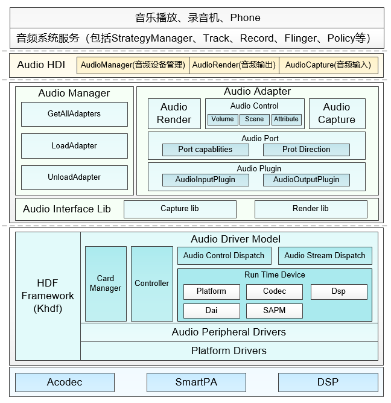
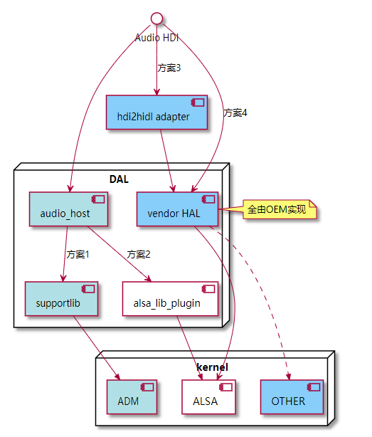

# WUKONG100 UIS7885芯片Audio适配


### Audio驱动框架介绍

Audio驱动框架基于HDF驱动框架实现，Audio驱动框架的组成：



社区RK3568走的是ADM适配，WUKONG100在以前采用tinyasla，因此在OpenHarmony上适配ALSA框架

音频驱动选的四种集成方案如下：




音频驱动框架模型，向上服务于多媒体音频子系统，便于系统开发者能够更便捷的根据场景来开发应用。向下服务于具体的设备厂商，芯片厂商可以根据此驱动架构，进行各自驱动的开发及HAL层接口的调用。

对于芯片而言，音频驱动已经支持alsa，只要通过alsa-lib对到HDF层，就可以实现快速开发和适配OpenHarmony系统。

### ALSA适配

ALSA使用OpenHarmony上自带的三方库alsa-lib对接WUKONG100底层的音频驱动，集成三方库alsa-utils工具以确认底层驱动设备节点是否正常

```
# aplay -l
**** List of PLAYBACK Hardware Devices ****
card 0: sprdphonesc2730 [sprdphone-sc2730], device 0: FE_ST_NORMAL_AP01 (*) []
  Subdevices: 1/1
  Subdevice #0: subdevice #0
card 0: sprdphonesc2730 [sprdphone-sc2730], device 1: FE_ST_NORMAL_AP23 (*) []
  Subdevices: 1/1
  Subdevice #0: subdevice #0
card 0: sprdphonesc2730 [sprdphone-sc2730], device 3: FE_ST_FAST (*) []
  Subdevices: 1/1
  Subdevice #0: subdevice #0
card 0: sprdphonesc2730 [sprdphone-sc2730], device 5: FE_ST_VOICE (*) []
  Subdevices: 1/1
  Subdevice #0: subdevice #0
card 0: sprdphonesc2730 [sprdphone-sc2730], device 6: FE_ST_VOIP (*) []
  Subdevices: 1/1
  Subdevice #0: subdevice #0
card 0: sprdphonesc2730 [sprdphone-sc2730], device 7: FE_ST_FM (*) []
  Subdevices: 1/1
  Subdevice #0: subdevice #0
card 0: sprdphonesc2730 [sprdphone-sc2730], device 10: FE_ST_LOOP (*) []
  Subdevices: 1/1
  Subdevice #0: subdevice #0
card 0: sprdphonesc2730 [sprdphone-sc2730], device 12: FE_ST_A2DP_PCM (*) []
  Subdevices: 1/1
  Subdevice #0: subdevice #0
card 0: sprdphonesc2730 [sprdphone-sc2730], device 15: FE_ST_FM_DSP (*) []
  Subdevices: 1/1
  Subdevice #0: subdevice #0
card 0: sprdphonesc2730 [sprdphone-sc2730], device 18: FE_ST_VOICE_PCM_P (*) []
  Subdevices: 1/1
  Subdevice #0: subdevice #0
card 0: sprdphonesc2730 [sprdphone-sc2730], device 19: FE_ST_TEST_CODEC (*) []
  Subdevices: 1/1
  Subdevice #0: subdevice #0
card 0: sprdphonesc2730 [sprdphone-sc2730], device 24: DisplayPort MultiMedia (*) []
  Subdevices: 1/1
  Subdevice #0: subdevice #0
card 0: sprdphonesc2730 [sprdphone-sc2730], device 25: FE_ST_MM_P (*) []
  Subdevices: 1/1
  Subdevice #0: subdevice #0
```

通过amixer配置播放、录音的音频通路后，使用aplay、arecord测试设备驱动的播放、录音效果

```
aplay -M -D hw:0,0 /etc/dynamic.wav
arecord -M -D hw:0,0 -r 8000 -c 1 -f S16_LE --period-size=640 --buffer-size=2560 /data/arecold.wav
```

### HDF层适配

1. 社区主干走的是ADM，默认没有开启ALSA编译，因此需要在产品//vendor/revoview/wukong100目录下的config.json中开启

   ```
   drivers_peripheral_audio_feature_alsa_lib = true
   ```

2. //vendor/revoview/wukong100/hals/audio目录下的ALSA相关的配置文件需要修改

   alsa_adapter.json是设备匹配的配置文件

   ```
   {
       "adapters": [
           {
               "name": "primary",
               "cardId": 0,
               "cardName": "sprdphonesc2730"
           },
           {
               "name": "hdmi",
               "cardId": 1,
               "cardName": "rockchiphdmi"
           }
       ]
   }
   
   ```

   alsa_paths.json是音频通路的配置文件，不同场景下音频的Speaker、Mic通话等需要写入相应的配置

   audio_policy_config.xml 是音频核心策略配置文件，音频流类型、使用场景、音频端口、路由规则等需要在此配置

   通话切换路由、听筒扬声器切换更新音频路由需要将updateRouteSupport设置为true

   ```
        <globalConfigs>
    	         <defaultOutput adapter="primary" pipe="primary_output" device="Speaker"/>
    	         <commonConfigs>
    	             <attribute name="updateRouteSupport" value="true"/>
    	             <attribute name="maxRendereres" value="128"/>
    	             <attribute name="maxCapturers" value="16"/>
    	         </commonConfigs>
   ```

3. 社区主干对alsa_paths.json文件的解析有问题，修改后已合入主干

   ```
    #include "cJSON.h"
    	 #include "osal_mem.h"
    	 #include "securec.h"
    	 #include "audio_common.h"
    	 
    	 #ifdef IDL_MODE
    	 #define HDF_LOG_TAG AUDIO_HDI_IMPL
   @@ -27,9 +28,9 @@	 
    	 
    	 #define SPEAKER                   "Speaker"
    	 #define HEADPHONES                "Headphones"
    	 #define MIC                       "Mic"
    	 #define HS_MIC                    "MicHs"
    	 #define EARPIECE                  "Earpiece"
    	 #define BLUETOOTH_SCO             "Bluetooth"
    	 #define BLUETOOTH_SCO_HEADSET     "Bluetooth_SCO_Headset"
    	 #define JSON_UNPRINT 1
   @@ -42,7 +43,8 @@	 
    	 #define AUDIO_DEV_ON  1
    	 #define AUDIO_DEV_OFF 0
    	 
    	 #define HDF_PATH_NUM_MAX (32 * 4)
    	 #define ADM_VALUE_SIZE 4
   ```

4. 增加设备切换和路由信息的切换修改，已合入主干

   ```
    int32_t AudioAdapterUpdateAudioRoute(
    	     struct IAudioAdapter *adapter, const struct AudioRoute *route, int32_t *routeHandle)
    	 {
    	     AUDIO_FUNC_LOGI("Enter.");
    	     struct AudioHwAdapter *hwAdapter = (struct AudioHwAdapter *)adapter;
    	     if (hwAdapter == NULL) {
    	         AUDIO_FUNC_LOGE("AudioAdapterUpdateAudioRoute Invalid input param!");
    	         return AUDIO_ERR_INVALID_PARAM;
    	     }
    	     if (renderId_ <= -1 || renderId_ >= MAX_AUDIO_STREAM_NUM) {
    	         AUDIO_FUNC_LOGE("render is Invalid");
    	         return AUDIO_ERR_INVALID_PARAM;
    	     }
    	     AUDIO_FUNC_LOGI("AudioAdapterUpdateAudioRoute renderId_: %{public}d", renderId_);
    	     struct IAudioRender *render = (struct IAudioRender *)hwAdapter->infos.renderServicePtr[renderId_];
    	     struct AudioHwRender *hwRender = (struct AudioHwRender *)render;
    	     if (hwRender == NULL) {
    	         AUDIO_FUNC_LOGE("hwRender is NULL!");
    	         return AUDIO_ERR_INTERNAL;
    	     }
    	 
    	     if (hwRender->devCtlHandle == NULL) {
    	         AUDIO_FUNC_LOGE("RenderSetVoiceVolume Bind Fail!");
    	         return AUDIO_ERR_INTERNAL;
    	     }
    	 
    	     InterfaceLibModeRenderPassthrough *pInterfaceLibModeRender = AudioPassthroughGetInterfaceLibModeRender();
    	     if (pInterfaceLibModeRender == NULL || *pInterfaceLibModeRender == NULL) {
    	         AUDIO_FUNC_LOGE("InterfaceLibModeRender not exist");
    	         return HDF_FAILURE;
    	     }
    	 
    	     int32_t ret =
    	         (*pInterfaceLibModeRender)(hwRender->devCtlHandle, &hwRender->renderParam, AUDIODRV_CTL_IOCTL_UPDATE_ROUTER);
    	     if (ret < 0) {
    	         AUDIO_FUNC_LOGE("Audio RENDER_CLOSE FAIL");
    	     }
    	 
    	     return AUDIO_SUCCESS;
    	 }
   ```

5. 增加通话音量调节，已合入主干

   ```
   int32_t AudioAdapterSetVoiceVolume(struct IAudioAdapter *adapter, float volume)
    	 {
    	     AUDIO_FUNC_LOGD("AudioAdapterSetVoiceVolume Enter.");
    	     int32_t ret = 0;
    	     struct AudioHwAdapter *hwAdapter = (struct AudioHwAdapter *)adapter;
    	     if (hwAdapter == NULL) {
    	         AUDIO_FUNC_LOGE("AudioAdapterSetVoiceVolume Invalid input param!");
    	         return AUDIO_ERR_INVALID_PARAM;
    	     }
    	     if (renderId_ <= -1 || renderId_ >= MAX_AUDIO_STREAM_NUM) {
    	         AUDIO_FUNC_LOGE("render is Invalid");
    	         return AUDIO_ERR_INVALID_PARAM;
    	     }
    	     AUDIO_FUNC_LOGI("AudioAdapterSetVoiceVolume renderId_: %{public}d", renderId_);
    	     struct IAudioRender *render = (struct IAudioRender *)hwAdapter->infos.renderServicePtr[renderId_];
    	     struct AudioHwRender *hwRender = (struct AudioHwRender *)render;
    	     if (hwRender == NULL) {
    	         AUDIO_FUNC_LOGE("hwRender is NULL!");
    	         return AUDIO_ERR_INTERNAL;
    	     }
    	 
    	     if (volume < 0 || volume > 1) {
    	         AUDIO_FUNC_LOGE("AudioAdapterSetVoiceVolume volume param Is error!");
    	         return AUDIO_ERR_INVALID_PARAM;
    	     }
    	     if (hwRender->devCtlHandle == NULL) {
    	         AUDIO_FUNC_LOGE("RenderSetVoiceVolume Bind Fail!");
    	         return AUDIO_ERR_INTERNAL;
    	     }
    	 
    	     InterfaceLibModeRenderPassthrough *pInterfaceLibModeRender = AudioPassthroughGetInterfaceLibModeRender();
    	     if (pInterfaceLibModeRender == NULL || *pInterfaceLibModeRender == NULL) {
    	         AUDIO_FUNC_LOGE("InterfaceLibModeRender not exist");
    	         return HDF_FAILURE;
    	     }
    	 
    	     hwRender->renderParam.renderMode.ctlParam.voiceVolume = volume;
    	 
    	     ret = (*pInterfaceLibModeRender)(hwRender->devCtlHandle, &hwRender->renderParam,
    	                                      AUDIODRV_CTL_IOCTL_VOICE_VOLUME_WRITTE);
    	     if (ret < 0) {
    	         AUDIO_FUNC_LOGE("Audio RENDER_CLOSE FAIL");
    	     }
    	     return AUDIO_SUCCESS;
    	 }
    	 
   ```

6. 社区主干RK3568音频代码没有通话功能，WUKONG100在ALSA方案的基础上实现了音频通话，在//device/board/revoview/wukong100/audio_alsa/目录进行了重新适配，主要是添加了通话场景对render、captuer的处理，切换不同场景时音频通路的切换，通话在对render设备设置同时需要对capture同时进行处理等

   ```
   int32_t RenderGetSceneDev(enum AudioCategory scene)
   {
       if (scene < AUDIO_IN_MEDIA || scene > AUDIO_MMAP_NOIRQ) {
           scene = AUDIO_IN_MEDIA;
       }
       if (scene == AUDIO_IN_CALL) {
           return SND_CALL_PCM_DEV;
       } else {
           return SND_DEFAULT_PCM_DEV;
       }
   }
   
   static bool CheckSceneIsChange(enum AudioCategory scene)
   {
       if (scene != AUDIO_IN_CALL) {
           if (g_currentScene == AUDIO_IN_CALL || g_currentScene == AUDIO_MMAP_NOIRQ) {
               return true;
           } else {
               return false;
           }
       } else {
           if (g_currentScene != AUDIO_IN_CALL) {
               return true;
           } else {
               return false;
           }
       }
   }
   
   static int32_t UpdateAudioRenderRoute(struct AlsaRender *renderIns, const struct AudioHwRenderParam *handleData)
   {
       CHECK_NULL_PTR_RETURN_DEFAULT(renderIns);
       struct AlsaSoundCard *cardIns = (struct AlsaSoundCard *)renderIns;
       CHECK_NULL_PTR_RETURN_DEFAULT(cardIns);
       int32_t ret;
       int32_t devCount = handleData->renderMode.hwInfo.pathSelect.deviceInfo.deviceNum;
   
       AUDIO_FUNC_LOGI("UpdateAudioRenderRoute devCount:%{public}d!", devCount);
       if (devCount < 0 || devCount > PATHPLAN_COUNT) {
           AUDIO_FUNC_LOGE("devCount is error!");
           return HDF_FAILURE;
       }
   
       struct AlsaMixerCtlElement elems[devCount];
       for (int i = 0; i < devCount; i++) {
           SndElementItemInit(&elems[i]);
   
           elems[i].numid = 0;
           elems[i].name = handleData->renderMode.hwInfo.pathSelect.deviceInfo.deviceSwitchs[i].deviceSwitch;
           elems[i].value = handleData->renderMode.hwInfo.pathSelect.deviceInfo.deviceSwitchs[i].value;
       }
   
       ret = SndElementGroupWrite(cardIns, elems, devCount);
       if (ret < 0) {
           AUDIO_FUNC_LOGE("render SndElementGroupWrite fail");
           return HDF_FAILURE;
       }
       return HDF_SUCCESS;
   }
   
   ```

### audio-framework适配

audio-framework作为通用代码，WUKONG100不涉及对此仓库的修改

### 相关仓

[**device_board_revoview**](https://gitcode.com/openharmony-sig/device_board_revoview)

[**vendor_revoview**](https://gitcode.com/openharmony-sig/vendor_revoview)

[**drivers_peripheral**](https://gitcode.com/openharmony/drivers_peripheral)
