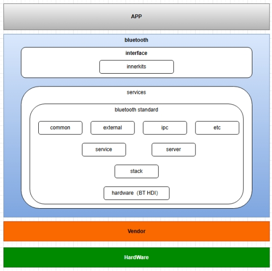
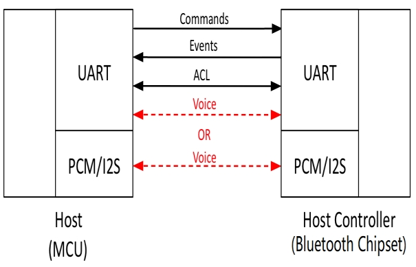

### BT框架

OpenHarmony 蓝牙架构如下图所示



APP 蓝牙应用程序，通过调用蓝牙接口(interface)实现应用程序的功能。

Bluetooth 蓝牙框架层，主要包括interface和services, interface负责向上层应用程序提供功能接口。services则负责interface接口和蓝牙协议栈的实现。

Vendor 厂商提供代码编译出的z.so，包含了OpenHarmony定义的vendor interface以及厂商的vendor lib。

HardWare 蓝牙硬件设备 这是指属于蓝牙controler。

蓝牙整体硬件架构上分为host和controler两部分；主机和控制器之间的通信遵循主机控制器接口（HCI），如下所示：



HCI（host controler interface）定义了如何交换命令，事件，异步和同步数据包。异步数据包（ACL）用于数据传输，而同步数据包（SCO）用于带有耳机和免提配置文件的语音。

适配工作主要是完成HCI接口对接。

### 硬件连接

展锐7885soc内部集成了蓝牙controler，因此HCI就不再是一个实际的UART ，SDIO或者USB接口，而是一个虚拟的通道。

### OpenHarmony 7885蓝牙适配

蓝牙集成在展锐7885内部，把厂商提供的hal 层代码修改编译成libbt_vendor.z.so供BT HDI使用。

 

libbt_vendor.z.so 将以下3处接口挂接上并实现。

1. 

bt_vendor_interface_t结构体，定义了vendor lib对外的接口，其中包括3个函数: init, op, close。

```c++
  typedef struct {
     /**
      * Set to sizeof(bt_vndor_interface_t)
      */
     size_t size;

     /**
      * Caller will open the interface and pass in the callback routines
      * to the implemenation of this interface.
      */
     int (*init)(const bt_vendor_callbacks_t* p_cb, unsigned char* local_bdaddr);

     /**
      * Vendor specific operations
      */
     int (*op)(bt_opcode_t opcode, void* param);

     /**
      * Closes the interface
      */
     void (*close)(void);
 } bt_vendor_interface_t;
```

 

需要在vendor lib中定义bt_vendor_interface_t，以下为参考代码：

```c++
// vendor lib接口定义
const bt_vendor_interface_t BLUETOOTH_VENDOR_LIB_INTERFACE = {
   sizeof(bt_vendor_interface_t),
   init,
   op,
   cleanup };
```

2. 

bt_vendor_callbacks_t是OpenHarmony提供给厂商lib调用的钩子函数，在调用bt_vendor_interface_t.init函数时，需要把bt_vendor_callbacks_t传递给厂商lib。

**

```c++
/**
 * initialization callback.
 */
typedef void (*init_callback)(bt_op_result_t result);

/** 
 * call the callback to malloc a size of buf.
 */
typedef void* (*malloc_callback)(int size);

/**
 * call the callback to free buf
 */
typedef void (*free_callback)(void* buf);

/**
 *  hci command packet transmit callback
 *  Vendor lib calls cmd_xmit_cb function in order to send a HCI Command
 *  packet to BT Controller. 
 *
 *  The opcode parameter gives the HCI OpCode (combination of OGF and OCF) of
 *  HCI Command packet. For example, opcode = 0x0c03 for the HCI_RESET command
 *  packet.
 */
typedef size_t (*cmd_xmit_callback)(uint16_t opcode, void* p_buf);

typedef struct {
    /**
     * set to sizeof(bt_vendor_callbacks_t)
     */
    size_t size;

    /* notifies caller result of init request */
    init_callback init_cb;

    /* buffer allocation request */
    malloc_callback alloc;

    /* buffer free request */
    free_callback dealloc;

    /* hci command packet transmit request */
    cmd_xmit_callback xmit_cb;
} bt_vendor_callbacks_t;
```

 

init_cb 用于通知配置结果；

alloc 用于申请内存；

dealloc 用于释放内存；

xmit_cb 用于下发hci命令；

OpenHarmony中这些钩子函数的定义

 

```c++
// vendor_interface.cpp

bt_vendor_callbacks_t VendorInterface::vendorCallbacks_ = {
    .size = sizeof(bt_vendor_callbacks_t),
    .init_cb = VendorInterface::OnInitCallback,
    .alloc = VendorInterface::OnMallocCallback,
    .dealloc = VendorInterface::OnFreeCallback,
    .xmit_cb = VendorInterface::OnCmdXmitCallback,
};
```

3. 各op操作的实现

op函数要对以下各op code做相应的处理。

```c++
/**
 * BT vendor lib cmd.
 */
typedef enum {
    /**
     * Power on the BT Controller.
     * @return 0 if success.
     */
    BT_OP_POWER_ON,

    /**
     * Power off the BT Controller.
     * @return 0 if success.
     */
    BT_OP_POWER_OFF,

    /**
     * Establish hci channels. it will be called after BT_OP_POWER_ON.
     * @param int (*)[HCI_MAX_CHANNEL].
     * @return fd count.
     */
    BT_OP_HCI_CHANNEL_OPEN,

    /**
     * Close all the hci channels which is opened.
     */
    BT_OP_HCI_CHANNEL_CLOSE,

    /**
     * initialization the BT Controller. it will be called after BT_OP_HCI_CHANNEL_OPEN.
     * Controller Must call init_cb to notify the host once it has been done.
     */
    BT_OP_INIT,

    /**
     * Get the LPM idle timeout in milliseconds.
     * @param (uint_32 *)milliseconds, btc will return the value of lpm timer.
     * @return 0 if success.
     */
    BT_OP_GET_LPM_TIMER,

    /**
     * Enable LPM mode on BT Controller.
     */
    BT_OP_LPM_ENABLE,

    /**
     * Disable LPM mode on BT Controller.
     */
    BT_OP_LPM_DISABLE,

    /**
     * Wakeup lock the BTC.
     */
    BT_OP_WAKEUP_LOCK,

    /**
     * Wakeup unlock the BTC.
     */
    BT_OP_WAKEUP_UNLOCK,

    /**
     * transmit event response to vendor lib.
     * @param (void *)buf, struct of HC_BT_HDR.
     */
    BT_OP_EVENT_CALLBACK
} bt_opcode_t;
```

