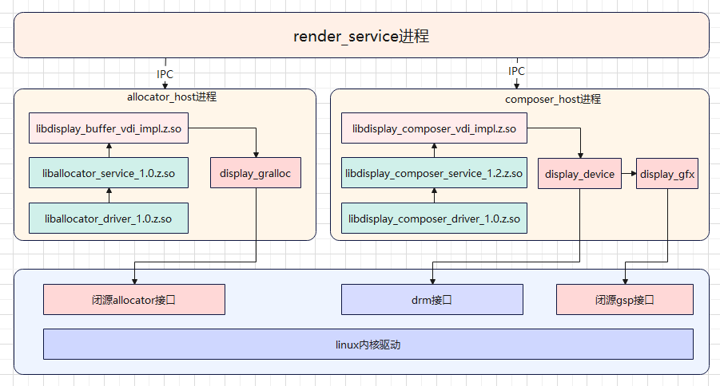

# display适配

-   [简介](#section01)
-   [显示HDI适配](#section02)
-   [GPU适配](#section03)

## 简介<a name="section01"></a>

本仓用于存放展锐Spreadtrum芯片display适配内容。

显示适配需要完成的工作：LCD驱动适配、图形服务HDI接口适配、GPU适配。

WUKONG100的LCD驱动适配使用linux原生驱动，具体参考内核适配过程。

## 显示HDI适配<a name="section02"></a>

[显示HDI](https://gitee.com/openharmony/drivers_peripheral/blob/master/display/README_zh.md)对图形服务提供显示驱动能力，包括显示图层的管理、显示内存的管理及硬件加速等。 显示HDI需要适配两部分：gralloc 和 display_device。其中display_device也包括硬件合成管理display_gfx等。整体架构如图所示：



目录结构如图所示：

```shell
display
├── BUILD.gn
├── include
└── src
    ├── display_device         # 显示设备管理、layer管理等
    │   ├── core
    │   ├── drm
    │   ├── fbdev
    │   └── vsync
    ├── display_gfx            # gsp硬件合成
    │   ├── display_gfx.cpp
    │   └── gsp
    │       ├── include
    │       └── src
    ├── display_gralloc        # allocator显示内存管理
    ├── display_layer_video
    └── utils
```

### gralloc适配

gralloc模块提供显示内存管理功能，OpenHarmony提供了使用与Hi3516DV300参考实现，厂商可根据实际情况参考适配，该实现基于drm开发，[源码链接](https://gitee.com/openharmony/drivers_peripheral/tree/master/display/hal/default_standard)。

展锐P7885的显示内存管理参考RK3568的实现，依赖展锐私有的allocator实现，对展锐私有的allocator进行封装，提供libdisplay_buffer_vdi_impl.z.so供allocator_host服务调用。

###  display device适配

display device模块提供显示设备管理、layer管理、硬件加速等功能。

OpenHarmony提供了[基于drm的Hi3516DV300芯片的参考实现](https://gitee.com/openharmony/drivers_peripheral/tree/master/display/hal/default_standard/src/display_device),该实现默认支持硬件合成；

展锐P7885的display device模块参考RK3568的实现，默认支持硬件合成。

OpenHarmony初步实现了展锐P7885的GSP、DPU等硬件合成，GPU硬件合成尚未支持。硬件合成策略参考

//drivers_peripheral/display/hal/default_standard/src/display_device/hdi_gfx_composition.cpp文件中修改set_layers方法。

```
int32_t HdiGfxComposition::SetLayers(std::vector<HdiLayer *> &layers, HdiLayer &clientLayer)
{
    DISPLAY_LOGD("layers size %{public}zd", layers.size());
    mClientLayer = &clientLayer;
    mCompLayers.clear();
    int32_t mask = CheckLayers(layers, 0);
    mClientLayer->SetAcceleratorType(ACCELERATOR_NON);
    HdiLayer *layer;
    uint32_t dpuSize = 0;
    for (uint32_t i = 0; i < layers.size(); i++) {
        layer = layers[i];
        if (CanHandle(*layer)) {
            if ((layer->GetCompositionType() != COMPOSITION_VIDEO) &&
                (layer->GetCompositionType() != COMPOSITION_POINTER)) {
#ifdef SPRD_7863
                if(!(mask & 0x03) && (layers.size() < 4))
#else
                if((mask == 0) && (layers.size() < 4))//直接给DPU处理
#endif
                {
                    layer->SetAcceleratorType(ACCELERATOR_DPU);
                    layer->SetDeviceSelect(COMPOSITION_DEVICE);
                    dpuSize++;
                    continue;
                }
#ifdef SPRD_7863
                else if ((mask & 0x07) == 0x03)
                {   
                    layer->SetAcceleratorType(ACCELERATOR_GPU);
                    layer->SetDeviceSelect(COMPOSITION_CLIENT);
                    if(mClientLayer->GetAcceleratorType() == ACCELERATOR_NON)
                    {
                        dpuSize++;
                        mClientLayer->SetAcceleratorType(ACCELERATOR_DPU);//输出结果给DPU显示
                    }
                    continue;
                }
#endif
                else
                {
                    //GSP+DPU
                    int32_t tempMask = CheckLayers(layers, i);
                    uint32_t tempSize = layers.size() - i;
#ifdef SPRD_7863
                    if(tempMask & 0x03)
#else
                    if(tempMask)//复杂场景交给GSP
#endif
                    {
                        layer->SetAcceleratorType(ACCELERATOR_GSP);
                        layer->SetDeviceSelect(COMPOSITION_DEVICE);
                        if(mClientLayer->GetAcceleratorType() == ACCELERATOR_NON)
                        {
                            dpuSize++;
                            mClientLayer->SetAcceleratorType(ACCELERATOR_DPU);//输出结果给DPU显示
                        }
                    }
                    else
                    {
#ifdef SPRD_7863
                        if((dpuSize + tempSize) < 5)
#else
                        if((dpuSize + tempSize) < 7)//dpu支持6个layer
#endif
                        {
                            layer->SetAcceleratorType(ACCELERATOR_DPU);
                            layer->SetDeviceSelect(COMPOSITION_DEVICE);
                            dpuSize++;
                            continue;
                        }
                        else
                        {
                            layer->SetAcceleratorType(ACCELERATOR_GSP);
                            layer->SetDeviceSelect(COMPOSITION_DEVICE);
                            if(mClientLayer->GetAcceleratorType() == ACCELERATOR_NON)
                            {
                                dpuSize++;
                                mClientLayer->SetAcceleratorType(ACCELERATOR_DPU);//输出结果给DPU显示
                            }
                        }
                    }
                }
                
            } else {
                layer->SetDeviceSelect(layer->GetCompositionType());
            }
            mCompLayers.push_back(layer);
        } else {
            layer->SetDeviceSelect(COMPOSITION_CLIENT);
            mClientLayer->SetAcceleratorType(ACCELERATOR_DPU);
            dpuSize = 1;
        }
    }
    DISPLAY_LOGD("composer layers size %{public}zd dpuSize=%{public}d mask=%{public}d", mCompLayers.size(), dpuSize, mask);
    return DISPLAY_SUCCESS;
}
```

当前旋转或缩放的Layer使用GSP硬件进行串行合成，可能影响性能。

GSP合成的实现依赖展锐闭源库，gfx_composition实现了对闭源库的调用，参考

//drivers_peripheral/display/hal/default_standard/src/display_device/hdi_gfx_composition.cpp文件中的GfxModuleInit方法。

```c++
int32_t HdiGfxComposition::GfxModuleInit(void)
{
    DISPLAY_LOGD();
    mGfxModule = dlopen(LIB_HDI_GFX_NAME, RTLD_NOW | RTLD_NOLOAD);
    if (mGfxModule != nullptr) {
        DISPLAY_LOGI("Module '%{public}s' already loaded", LIB_HDI_GFX_NAME);
    } else {
        DISPLAY_LOGI("Loading module '%{public}s'", LIB_HDI_GFX_NAME);
        mGfxModule = dlopen(LIB_HDI_GFX_NAME, RTLD_NOW);
        if (mGfxModule == nullptr) {
            DISPLAY_LOGE("Failed to load module: %{public}s", dlerror());
            return DISPLAY_FAILURE;
        }
    }

    using InitFunc = int32_t (*)(GfxFuncs **funcs);
    InitFunc func = reinterpret_cast<InitFunc>(dlsym(mGfxModule, LIB_GFX_FUNC_INIT));
    if (func == nullptr) {
        DISPLAY_LOGE("Failed to lookup %{public}s function: %s", LIB_GFX_FUNC_INIT, dlerror());
        dlclose(mGfxModule);
        return DISPLAY_FAILURE;
    }
    return func(&mGfxFuncs);
}
```

### 测试验证

hello_composer测试模块：Rosen图形框架提供的测试程序，主要显示流程，HDI接口等功能是否正常。默认随系统编译。

代码路径：

```
foundation/graphic/graphic_2d/rosen/samples/composer
├── BUILD.gn
├── hello_composer.cpp
├── hello_composer.h
├── layer_context.cpp
├── layer_context.h
└── main.cpp
```

具体验证如下：

1. 关闭render service

  ```
  service_control stop render_service
  ```

2. 关闭 foundation进程

  ```
  service_control stop foundation
  ```

3. 运行hello_composer 测试相关接口

```
./hello_composer
```


## GPU适配<a name="section03"></a>

展锐P7885提供了GPU驱动的闭源实现，参考RK3568的实现，对闭源库进行链接，参考如下：

```shell
ohos_prebuilt_shared_library( "GLES_mali" ){
    source = "${GPU_LIB_PATH}/lib64/libGLES_mali.z.so"
    relative_install_dir = "chipsetsdk"
    symlink_target_name = [
        "libEGL_impl.so",
        "libGLESv1_impl.so",
        "libGLESv2_impl.so",
        "libGLESv3_impl.so",
        "libmali.so.0",
        "libmali.so.1",
    ]
    install_enable = true
    install_images = [ chipset_base_dir ]
    part_name = "${PART_NAME}"
    subsystem_name = "${SUBSYSTEM_NAME}"
}
```
