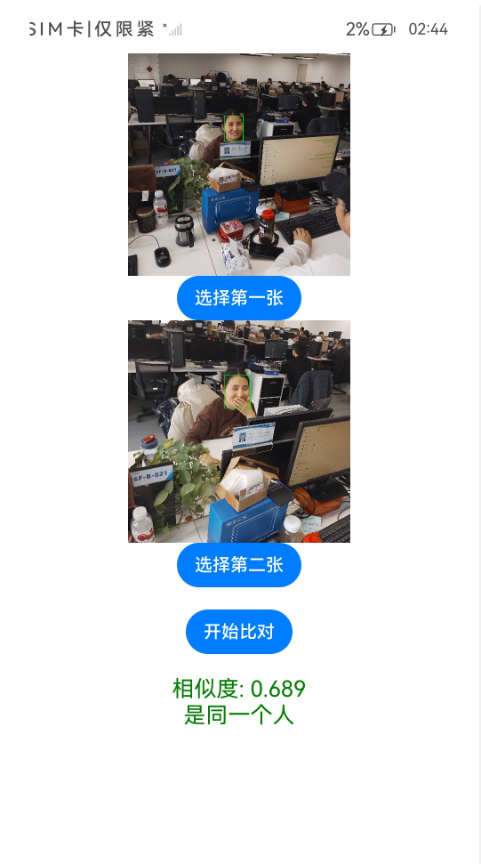

# Universal NPU Face Recognition Example

### Introduction

This example guides developers on how to utilize the Unisoc NPU face recognition functionality on OpenHarmony, including core steps such as face detection, feature extraction, and similarity calculation.

### Preview

### Usage Instructions

#### Face Comparison Function (Index.ets)

1. Install the compiled hap package and open the application.

3. Select two images from the interface respectively.

5. Click "Start Comparison" to calculate whether they are the same person.

7. If the similarity is greater than or equal to 0.6, display "Same Person"; otherwise, display "Not the Same Person".

### Project Directory

```
FaceNetApp/
├── entry/                          # Main module
│   ├── src/
│   │   ├── main/
│   │   │   ├── ets/                # ArkTS source code
│   │   │   │   ├── entryability/   # Application entry
│   │   │   │   │   └── EntryAbility.ets
│   │   │   │   └── pages/          # Page components
│   │   │   │       ├── Index.ets           # Face comparison page
│   │   │   │       ├── IndexCamera.ets     # Camera real-time recognition page
│   │   │   │       ├── CameraService.ts     # Camera service
│   │   │   │       └── Logger.ts            # Logging utility
│   │   │   ├── cpp/                # C++ source code
│   │   │   │   ├── FaceNet.cpp              # FaceNet model implementation
│   │   │   │   ├── UltraFace.cpp            # UltraFace model implementation
│   │   │   │   ├── FaceRecognitionEngine.cpp # Face recognition engine
│   │   │   │   ├── napi_init.cpp            # NAPI interface initialization
│   │   │   │   ├── utils.cpp                # Utility functions
│   │   │   │   ├── CMakeLists.txt           # CMake configuration
│   │   │   │   └── include/                 # Header files
│   │   │   │       ├── FaceNet.h
│   │   │   │       ├── UltraFace.h
│   │   │   │       ├── FaceRecognitionEngine.h
│   │   │   │       ├── Common.h
│   │   │   │       └── FaceDetect.h
│   │   │   └── resources/          # Resource files
│   │   │       └── rawfile/        # Model files
│   │   │           ├── version-RFB-640_s8s8.unm  #UltraFace model
│   │   │           └── facenet_s8s8.unm          # FaceNet model
│   │   └── ohosTest/               # Test code
│   └── libs/                       # Third-party libraries
│       └── arm64-v8a/              # ARM64 architecture libraries
│           ├── libopencv_*.so      # OpenCV libraries
│           ├── libuniai.so         # UniAI library
│           └── unisoc_NPU_backend.so  # Unisoc NPU backend
├── oh-package.json5                # Project dependency configuration
└── build-profile.json5             # Build configuration
```

### Specific Implementation

This example completes inference calculations based on the Unisoc NPU, implementing functionality through collaboration between ArkTS (frontend layer) and C++ (core algorithm layer).

1. Model Initialization: Load the UltraFace and FaceNet models onto the NPU in FaceRecognitionEngine::Init().

3. Face Detection: Use the UltraFace model to detect face regions in images.

5. Feature Extraction: Use the FaceNet model to extract face feature vectors (128-dimensional).

7. Similarity Calculation: Calculate the similarity between two face feature vectors via cosine similarity.

#### Main NAPI Interfaces

| Interface Name | Description |
|--------|------|
| `LoadModel(resourceManager: ResourceManager): void`| Initialize models |
| `ReleaseModel(): void` |  Release models |
| `DetectJpgFace(buffer: ArrayBuffer): FaceEmbeddings` |Detect faces in JPG format images (synchronous), returning face feature vectors and cropped face images |
| `DetectPixelFace(buffer: ArrayBuffer, width: number, height: number<FaceEmbeddings>` | Detect faces in PixelMap format images (asynchronous), returning face feature vectors and cropped face images |
| `Comparedings(embedding1: number[], embedding2: number[]): number` | Compare similarity between two face feature vectors, returning a similarity value between 0 and 1 |

#### FaceEmbeddings Structure

```typescript
interface FaceEmbeddings {
  value: number[];      // 128-dimensional face feature vector
  image: {              // Cropped face image
    data: ArrayBuffer;  // Image data
    width: number;      // Image width
    height: number;     // Image height
  };
}
```

#### Source Code Reference

Refer to the files in the：[main directory](entry/src/main/)。

### Related Permissions

Not applicable.

### Dependencies

- OpenCV: Used for image processing and format conversion

- UniAI: Unisoc NPU inference framework

- Unisoc NPU Backend: Provides NPU hardware acceleration capabilities

### Constraints and Limitations

1. This example only runs on standard systems and supports the following devices: wukong100, 7885 developer phone (for the 7885 developer phone, the NPU device node /dev/vha0 permissions must be manually changed to 666).

3. This example uses the Stage model, supports API12 version SDK (SDK version: API Version 12 Release, image version: 5.0 Release).

5. This example requires DevEco Studio version 6.0.0 Release or later to compile and run.

7. The device must support Unisoc NPU hardware acceleration.

9. Model files must be placed in the resources/rawfile/ directory:

- version-RFB-640_s8s8.unm (UltraFace face detection model)

- facenet_s8s8.unm (FaceNet face feature extraction model)

### Download

To download this project separately, execute the following commands:

```
git init
git config core.sparsecheckout true
echo code/AI/FaceNetApp/ > .git/info/sparse-checkout
git remote add origin https://gitcode.com/openharmony/applications_app_samples.git
git pull origin OpenHarmony_standard_p7885_rk3588_d3000m_20251124
```
