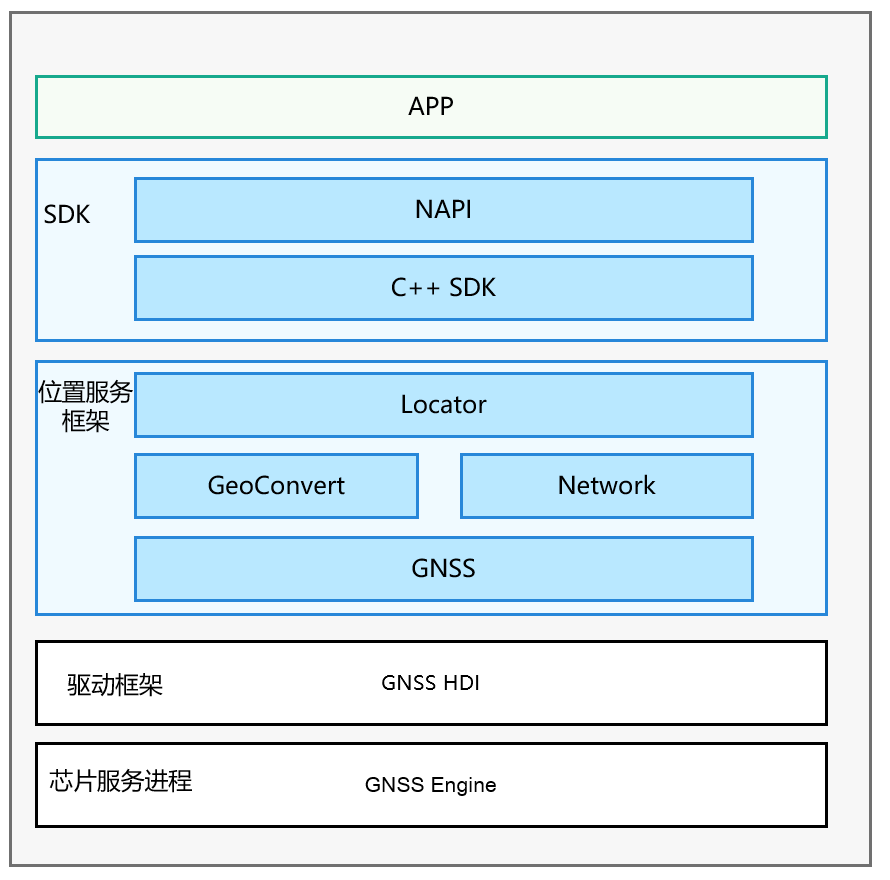
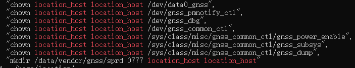
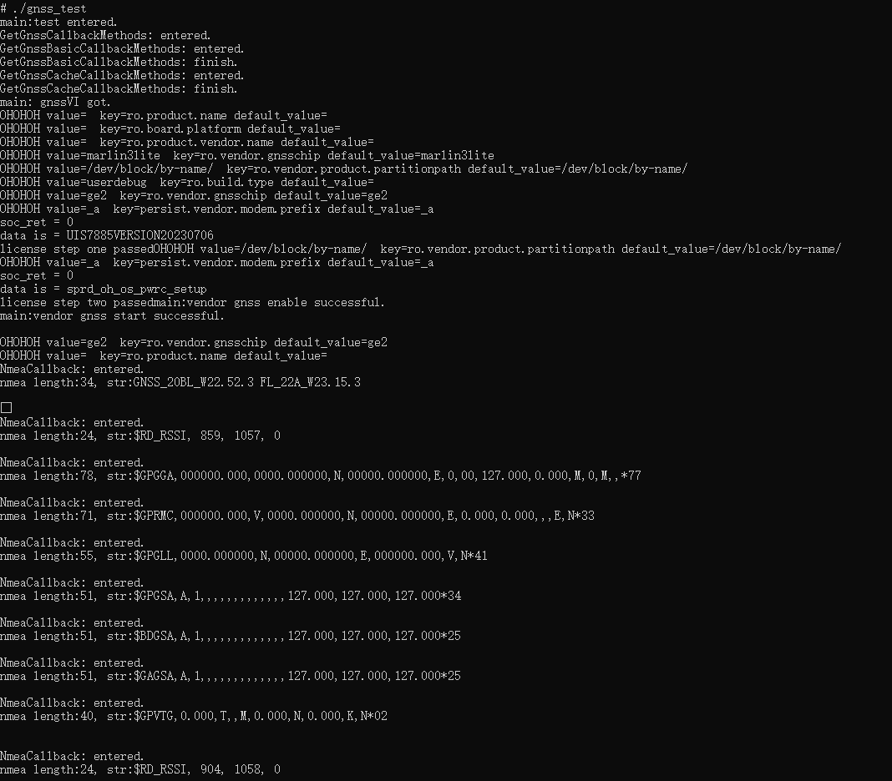
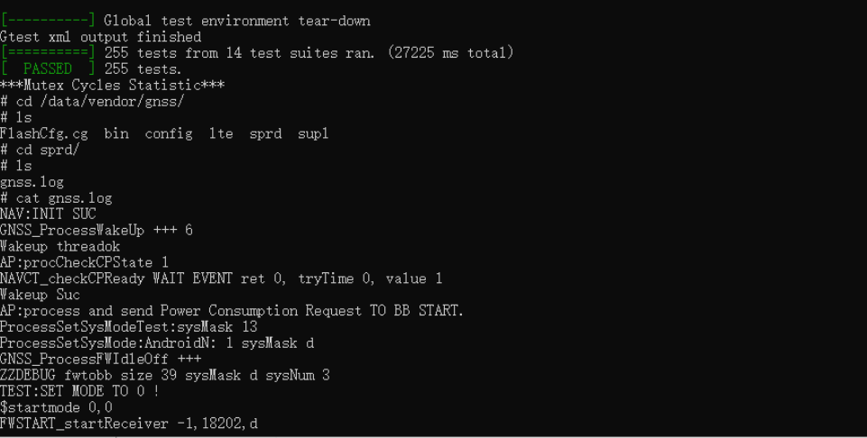

# Gnss Driver Interface Adaptation

### 1. GNSS Driver Framework Introduction

The location service component is used to determine where the user's device is, using latitude and longitude to represent the device's location. OpenHarmony uses multiple positioning technologies to provide location services, such as GNSS positioning, base station positioning, WLAN/Bluetooth positioning (base station positioning and WLAN/Bluetooth positioning are collectively referred to as "network positioning technology").

#### 1.1 Source Code Framework Introduction

```
/base/location/location      # Source code directory structure:
  ├── figures       # Store architecture diagrams in readme
  ├── frameworks    # Framework code
  ├── interfaces    # External interfaces 
  ├── sa_profile    # SA configuration files
  ├── services      # Location service SA code directory
  ├── test          # Test code directory
device/soc/unisoc/p7885/location/gnss # Driver interface adaptation
  ├── vendorGnssAdapter.cpp # Compiled into vendorGnssAdapter.so
drivers/peripheral/location # HDI interface layer
drivers/interface/location/gnss/v1_0 # IDL interface
device/board/revoview/wukong100\init.uis7885.gnss.cfg # Init configuration file
vendor/revoview/wukong100/hdf_config/uhdf # HCS configuration file
device/soc/unisoc/p7885/hardware/location/lib64/libgnssmgt.so # Closed source library
```

HDF GNSS Framework Overall Diagram



GNSS Framework Overall Diagram Description:

- NAPI component is a set of external interfaces based on the Node.js N-API specification for native module extension development framework
- C++ SDK is mainly used for server-side C++ applications, such as background services for C++ applications
- All functional APIs related to basic positioning capabilities are provided through Locator (where input parameters need to provide the current application's AbilityInfo information for system management of application positioning requests)
- All functional APIs related to (reverse) geocoding conversion capabilities are provided through GeoConvert

### 2. NAPI Usage Instructions

#### 2.1 NAPI Interface Description

Table 1 Location Information API Table

| Interface Name                                                                                                                                                                                   | Function Description                                          |
| ------------------------------------------------------------------------------------------------------------------------------------------------------------------------------------- | --------------------------------------------- |
| on(type:&nbsp;'locationChange',&nbsp;request:&nbsp;LocationRequest,&nbsp;callback:&nbsp;Callback&lt;Location&gt;)&nbsp;:&nbsp;void                                                    | Enable location change subscription and initiate location request.                             |
| off(type:&nbsp;'locationChange',&nbsp;callback?:&nbsp;Callback&lt;Location&gt;)&nbsp;:&nbsp;void                                                                                      | Disable location change subscription and delete corresponding location request.                          |
| on(type:&nbsp;'locationServiceState',&nbsp;callback:&nbsp;Callback&lt;boolean&gt;)&nbsp;:&nbsp;void                                                                                   | Subscribe to location service status changes.                                   |
| off(type:&nbsp;'locationServiceState',&nbsp;callback:&nbsp;Callback&lt;boolean&gt;)&nbsp;:&nbsp;void                                                                                  | Unsubscribe from location service status changes.                                 |
| on(type:&nbsp;'cachedGnssLocationsReporting',&nbsp;<br />request:&nbsp;CachedGnssLocationsRequest,&nbsp;callback:&nbsp;Callback&lt;Array&lt;Location&gt;&gt;)&nbsp;:&nbsp;void;       | Subscribe to cached GNSS location reporting.                                 |
| off(type:&nbsp;'cachedGnssLocationsReporting',&nbsp;callback?:&nbsp;Callback&lt;Array&lt;Location&gt;&gt;)&nbsp;:&nbsp;void;                                                          | Unsubscribe from cached GNSS location reporting.                               |
| on(type:&nbsp;'gnssStatusChange',&nbsp;callback:&nbsp;Callback&lt;SatelliteStatusInfo&gt;)&nbsp;:&nbsp;void;                                                                          | Subscribe to satellite status information update events.                                 |
| off(type:&nbsp;'gnssStatusChange',&nbsp;callback?:&nbsp;Callback&lt;SatelliteStatusInfo&gt;)&nbsp;:&nbsp;void;                                                                        | Unsubscribe from satellite status information update events.                               |
| on(type:&nbsp;'nmeaMessageChange',&nbsp;callback:&nbsp;Callback&lt;string&gt;)&nbsp;:&nbsp;void;                                                                                      | Subscribe to GNSS&nbsp;NMEA information reporting.                         |
| off(type:&nbsp;'nmeaMessageChange',&nbsp;callback?:&nbsp;Callback&lt;string&gt;)&nbsp;:&nbsp;void;                                                                                    | Unsubscribe from GNSS&nbsp;NMEA information reporting.                       |
| on(type:&nbsp;'fenceStatusChange',&nbsp;request:&nbsp;GeofenceRequest,&nbsp;want:&nbsp;WantAgent)&nbsp;:&nbsp;void;                                                                   | Add geofence and subscribe to geofence event reporting.                              |
| off(type:&nbsp;'fenceStatusChange',&nbsp;request:&nbsp;GeofenceRequest,&nbsp;want:&nbsp;WantAgent)&nbsp;:&nbsp;void;                                                                  | Delete geofence and unsubscribe from geofence events.                              |
| getCurrentLocation(request:&nbsp;CurrentLocationRequest,&nbsp;callback:&nbsp;AsyncCallback&lt;Location&gt;)&nbsp;:&nbsp;void                                                          | Get current location, using callback to return results asynchronously.                    |
| getCurrentLocation(request?:&nbsp;CurrentLocationRequest)&nbsp;:&nbsp;Promise&lt;Location&gt;                                                                                         | Get current location, using Promise to return results asynchronously.                     |
| getLastLocation(callback:&nbsp;AsyncCallback&lt;Location&gt;)&nbsp;:&nbsp;void                                                                                                        | Get last location, using callback to return results asynchronously.                   |
| getLastLocation()&nbsp;:&nbsp;Promise&lt;Location&gt;                                                                                                                                 | Get last location, using Promise to return results asynchronously.                    |
| isLocationEnabled(callback:&nbsp;AsyncCallback&lt;boolean&gt;)&nbsp;:&nbsp;void                                                                                                       | Check if location service is enabled, using callback to return results asynchronously.              |
| isLocationEnabled()&nbsp;:&nbsp;Promise&lt;boolean&gt;                                                                                                                                | Check if location service is enabled, using Promise to return results asynchronously.               |
| requestEnableLocation(callback:&nbsp;AsyncCallback&lt;boolean&gt;)&nbsp;:&nbsp;void                                                                                                   | Request to enable location service, using callback to return results asynchronously.                  |
| requestEnableLocation()&nbsp;:&nbsp;Promise&lt;boolean&gt;                                                                                                                            | Request to enable location service, using Promise to return results asynchronously.                   |
| enbleLocation(callback:&nbsp;AsyncCallback&lt;boolean&gt;)&nbsp;:&nbsp;void                                                                                                           | Enable location service, using callback to return results asynchronously.                    |
| enableLocation()&nbsp;:&nbsp;Promise&lt;boolean&gt;                                                                                                                                   | Enable location service, using Promise to return results asynchronously.                     |
| disableLocation(callback:&nbsp;AsyncCallback&lt;boolean&gt;)&nbsp;:&nbsp;void                                                                                                         | Disable location service, using callback to return results asynchronously.                    |
| disableLocation()&nbsp;:&nbsp;Promise&lt;boolean&gt;                                                                                                                                  | Disable location service, using Promise to return results asynchronously.                     |
| getCachedGnssLocationsSize(callback:&nbsp;AsyncCallback&lt;number&gt;)&nbsp;:&nbsp;void;                                                                                              | Get the number of cached GNSS locations, using callback to return results asynchronously.             |
| getCachedGnssLocationsSize()&nbsp;:&nbsp;Promise&lt;number&gt;;                                                                                                                       | Get the number of cached GNSS locations, using Promise to return results asynchronously.              |
| flushCachedGnssLocations(callback:&nbsp;AsyncCallback&lt;boolean&gt;)&nbsp;:&nbsp;void;                                                                                               | Get all GNSS cached locations and clear GNSS cache queue, using callback to return results asynchronously. |
| flushCachedGnssLocations()&nbsp;:&nbsp;Promise&lt;boolean&gt;;                                                                                                                        | Get all GNSS cached locations and clear GNSS cache queue, using Promise to return results asynchronously.  |
| sendCommand(command:&nbsp;LocationCommand,&nbsp;callback:&nbsp;AsyncCallback&lt;boolean&gt;)&nbsp;:&nbsp;void;                                                                        | Send extended commands to location service subsystem, using callback to return results asynchronously.            |
| sendCommand(command:&nbsp;LocationCommand)&nbsp;:&nbsp;Promise&lt;boolean&gt;;                                                                                                        | Send extended commands to location service subsystem, using Promise to return results asynchronously.             |
| isLocationPrivacyConfirmed(type&nbsp;:&nbsp;LocationPrivacyType,&nbsp;callback:&nbsp;AsyncCallback&lt;boolean&gt;)&nbsp;:&nbsp;void;                                                  | Query whether user agrees to location service privacy statement, using callback to return results asynchronously.         |
| isLocationPrivacyConfirmed(type&nbsp;:&nbsp;LocationPrivacyType,)&nbsp;:&nbsp;Promise&lt;boolean&gt;;                                                                                 | Query whether user agrees to location service privacy statement, using Promise to return results asynchronously.          |
| setLocationPrivacyConfirmStatus(type&nbsp;:&nbsp;LocationPrivacyType,&nbsp;isConfirmed&nbsp;:&nbsp;boolean,&nbsp;<br />callback:&nbsp;AsyncCallback&lt;boolean&gt;)&nbsp;:&nbsp;void; | Set and record whether user agrees to location service privacy statement, using callback to return results asynchronously.      |
| setLocationPrivacyConfirmStatus(type&nbsp;:&nbsp;LocationPrivacyType,&nbsp;isConfirmed&nbsp;:&nbsp;boolean)&nbsp;:&nbsp;Promise&lt;boolean&gt;;                                       | Set and record whether user agrees to location service privacy statement, using Promise to return results asynchronously.       |

#### 2.2 Steps for Application Layer to Obtain Device Location Information

##### 2.2.1 Obtain Location Permission

Need to apply for ohos.permission.LOCATION and ohos.permission.LOCATION_IN_BACKGROUND permissions. For details, refer to [accesstoken-guidelines.md](https://gitee.com/openharmony/docs/blob/OpenHarmony-3.2-Release/zh-cn/application-dev/security/accesstoken-guidelines.md)

##### 2.2.2 Import geolocation Module

```js
import geolocation from '@ohos.geolocation'
```

##### 2.2.3 Instantiate LocationRequest Object to Inform the System What Type of Location Service to Provide and Location Result Reporting Frequency

- Method 1
  
  Provide API usage methods close to usage scenarios for developers
  
  ```c
  export enum LocationRequestScenario {
     UNSET = 0x300,
     NAVIGATION,// Navigation scenario
     TRAJECTORY_TRACKING,// Trajectory tracking scenario
     CAR_HAILING,// Car hailing scenario
     DAILY_LIFE_SERVICE,// Daily life service scenario
     NO_POWER,// No power scenario
  }
  ```
  
  Taking navigation scenario as an example
  
  ```c
  var requestInfo = {
      'scenario':0x301,
      'timeInterval':0,
      'distanceInterval':0,
      'maxAccuracy':0
  };
  ```

- Method 2
  
  Provide location priority strategy API
  
  ```c
  export enum LocationRequestPriority {
    UNSET = 0x200,
    ACCURACY,// Location accuracy priority strategy
    LOW_POWER,// Fast location priority strategy
    FIRST_FIX,// Low power location priority strategy
  }
  ```
  
  Taking location accuracy priority strategy as an example
  
  ```c
  var requestInfo = {
     'priority':0x201,
     'timeInterval':0,
     'distanceInterval':0,
     'maxAccuracy':0
  };
  ```

##### 2.2.4 Instantiate Callback Object to Provide Location Reporting Path to the System

Applications need to implement the callback interface defined by the system and instantiate it. The system will report the real-time location result of the device through this interface when location is successfully determined.

```js
var locationChange = (location) => {
    console.log('locationChanger:data' + JSON.stringify(location));
}
```

##### 2.2.5 Start Positioning

```js
geolocation.on('locationChange',requestInfo,locationChange);
```

##### 2.2.6 End Positioning

```c
geolocation.on('locationChange',locationChange);
```

##### 2.2.7 Get Last Historical Location (Optional)

```c
geolocation.getLastLocation((data) => {
    console.log('locationChanger:data' + JSON.stringify(location)); 
}
)
```

#### 2.3 Steps for Application Layer to Perform Coordinate and Geocoding Conversion

##### 2.3.1 Import geolocation Module

```js
import geolocation from '@ohos.geolocation'
```

##### 2.3.2 Convert Coordinates to Geographic Location

```js
var reverseGeocodeRequest = {"latitude": 31.12, "longitude": 121.11, "maxItems": 1};
geolocation.getAddressesFromLocation(reverseGeocodeRequest, (data) => {
   console.log('getAddressesFromLocation: ' + JSON.stringify(data));
});
```

##### 2.3.3 Convert Location Description to Coordinates

```js
var geocodeRequest = {"description": "上海市浦东新区xx路xx号", "maxItems": 1};
geolocation.getAddressesFromLocationName(geocodeRequest, (data) => {
   console.log('getAddressesFromLocationName: ' + JSON.stringify(data));
});
```

### 2. GNSS Framework HDI Interface Adaptation Description in OH:

The HDI interface of GNSS corresponds one-to-one logically with the GNSS native driver interface (Linux or Android driver provided by the manufacturer), but specific parameters and function names need to be converted and mapped.

Four HDI interface functions: *EnableGnss*, *DisableGnss*, *StartGnss*, *StopGnss*

Four GNSS native driver interface functions: *gnss_enable*, *gnss_disable*, *gnss_start*, *gnss_stop*

In vendorGnssAdapter.cpp, convert and encapsulate the parameters of native driver interface functions into HDI interface functions, then compile them into so files for HDI layer to call.

### 3. Prerequisites for Adapting OH GNSS Framework

- Closed source GNSS driver provided by the manufacturer (e.g., libgnssmgt.so)

- Test whether native GNSS is working properly. Switch current user to location_host, modify /etc/passwd:
  
  ```bash
  base/startup/init/services/etc/group:location_host:x:1022:
  base/startup/init/services/etc/passwd:loation_host:x:1022:1022:::/bin/false
  ```

### 4. GNSS Adaptation Process

#### 4.1 Configuration File Modification

vendor/XXX/XXX/hdf_config/uhdf/device_info.hcs

```json
location :: host {
    hostName = "location_host";
    priority = 50;
    uid = "location_host";
    gid = ["location_host"];
    location_gnss_device :: device {
        device0 :: deviceNode {
            policy = 2;
            priority = 100;
            preload = 2;
            moduleName = "liblocation_gnss_hdi_driver.z.so";
            serviceName = "gnss_interface_service";
        }
    }
    location_agnss_device :: device {
        device0 :: deviceNode {
            policy = 2;
            priority = 100;
            preload = 2;
            moduleName = "liblocation_agnss_hdi_driver.z.so";
            serviceName = "agnss_interface_service";
        }
    }
    location_geofence_device :: device {
        device0 :: deviceNode {
            policy = 2;
            priority = 100;
            preload = 2;
            moduleName = "liblocation_geofence_hdi_driver.z.so";
            serviceName = "geofence_interface_service";
        }
    }
}
```

#### 4.2 Modify GNSS Node Permissions

The GNSS driver may need to read and write configuration files, device files, or system status during operation. The corresponding files need to be changed to owner location_host. File permissions are automatically modified at each boot.
/vendor/etc/init.product_name.cfg

```c
"name":"boot", "cmds":[
..........................,// Add the following fields, modify names according to actual file names
chown location_host location_host /dev/gnss0,
chmod 660 /dev/gnss0,
chwon location_host location_host ..., 
chmod 660 ....
]
```

For example, init.xxx.gnss.cfg


#### 4.3 Compile vendorGnssAdapter.so

Place source files vendorGnssAdapter.cpp and vendorGnssAdapter.h in device/board/company_name/${device_name}/gnss directory.
In vendorGnssAdapter.cpp, convert and encapsulate the parameters of native driver interface functions into HDI interface functions.

```c
#define GNSSMGT "/vendor/soc_platform/lib64/libgnssmgt.z.so"
...
int gnss_enable(GnssCallbackStruct *callbacks) {
  LBSLOGE(GNSS, "%{public}s entered", GNSSMGT);
  if (callbacks == nullptr){
    LBSLOGE(GNSS, "%{public}s callbacks == nullptr return", GNSSMGT);
  }
  DL_RET ret=SO_OK;
  g_GCS_ = *callbacks;
  g_Handle = dlopen(GNSSMGT, RTLD_LAZY);
  LBSLOGE(GNSS, "%{public}s GNSSMGT handle addr is %x", GNSSMGT, g_Handle);
  if (g_Handle == NULL) 
  {
    LBSLOGE(GNSS, "%{public}s load failed", GNSSMGT);
    return LOAD_NOK;
  }
  gps_init = (pGnssmgt_init)dlsym(g_Handle, "gnssmgt_init");
  LBSLOGE(GNSS, "%{public}s gps_init addr is %{public}x", GNSSMGT, gps_init);
  gps_start = (pGnssmgt_start)dlsym(g_Handle, "gnssmgt_start");
  LBSLOGE(GNSS, "%{public}s gps_start addr is %{public}x", GNSSMGT, gps_start);
  gps_stop = (pGnssmgt_stop)dlsym(g_Handle, "gnssmgt_stop");
  LBSLOGE(GNSS, "%{public}s gps_stop addr is %{public}x", GNSSMGT, gps_stop);
  gps_cleanup = (pGnssmgt_cleanup)dlsym(g_Handle, "gnssmgt_cleanup");
  LBSLOGE(GNSS, "%{public}s gps_cleanup addr is %{public}x", GNSSMGT, gps_cleanup);
  ...
  gps_init(&sGpsCallbacks);
  return ret;
}
```

Modify ohos.build, add dependent so modules and source code modules

```json
{
    "subsystem": "subsystem_name",
    "parts": {
        "component_name": {
        "module_list": [
.....
        "//device/board/company_name/${device_name}/gnss:vendorGnssAdapter",
.....
            ]
        }
    }
}
```

Write BUILD.gn, configure specific paths and source code for dependent modules

```json
import("//build/ohos.gni")
import("//vendor/$product_company/$product_name/product.gni")
ohos_shared_library("vendorGnssAdapter") {
    output_name = "vendorGnssAdapter"
    cflags = [
        "-w",
        "-g",
        "-O",
        "-fPIC",
    ]
defines += [
    "__USER__"
]
include_dirs = [
    "//drivers/peripheral/location/gnss/hdi_service",
    "//base/location/interfaces/inner_api/include",
]
sources = [
    "vendorGnssAdapter.cpp",
]
deps = [
]
external_deps = [
    "hiviewdfx_hilog_native:libhilog",
]
install_images = [ chipset_base_dir ]
part_name = "component_name"
subsystem_name = "subsystem_name"
install_enable = true
output_prefix_override = true
output_extension = "so"
}
```

#### 4.4 HDI Layer Loads vendorGnssAdapter.so

```c
  const std::string VENDOR_NAME = "vendorGnssAdapter.so";// Vendor driver
  void LocationVendorInterface::Init()// Initialize and load driver
  {
      ...
      vendorHandle_ = dlopen(VENDOR_NAME.c_str(), RTLD_LAZY);
      ...
      GnssVendorDevice *gnssDevice = static_cast<GnssVendorDevice *>(dlsym(vendorHandle_, "GnssVendorInterface"));
      ...
      vendorInterface_ = gnssDevice->get_gnss_interface();
      ...
  }
```

### 5. Testing and Verification

#### 5.1 Compilation

```bash
./build.sh --product-name yangfan --ccache -T LocatorFuzzTest
./build.sh --product-name yangfan --ccache -T gnss_test
./build.sh --product-name yangfan --ccache -T LocatorServiceAbilityTest
```

#### 5.2 Driver Testing

```bash
hdc file send gnss_test /data/
hdc shell
cd /data
chmod 777 gnss_test 
./gnss_test
```



#### 5.3 Service Testing

```bash
hdc file send LocatorServiceAbilityTest /data/
hdc shell
cd /data
chmod 777 LocatorServiceAbilityTest 
./LocatorServiceAbilityTest
```

View log


#### 5.4 Location App Testing

```bash
hdc app install -r Location.hap
```

### Related Repositories

[base_location](https://gitee.com/openharmony/base_location/blob/master/README.md)
