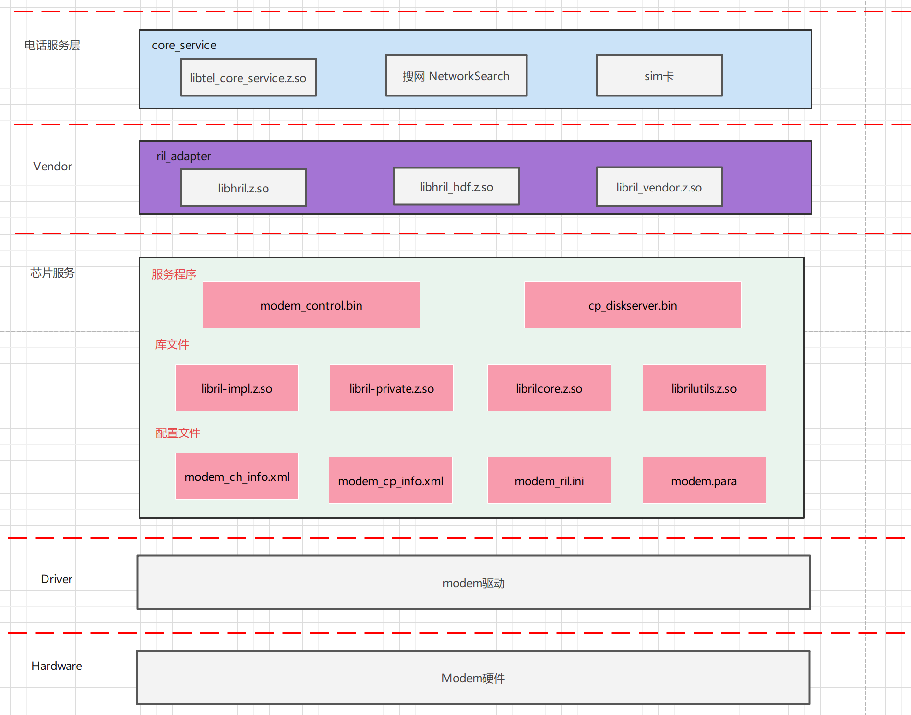
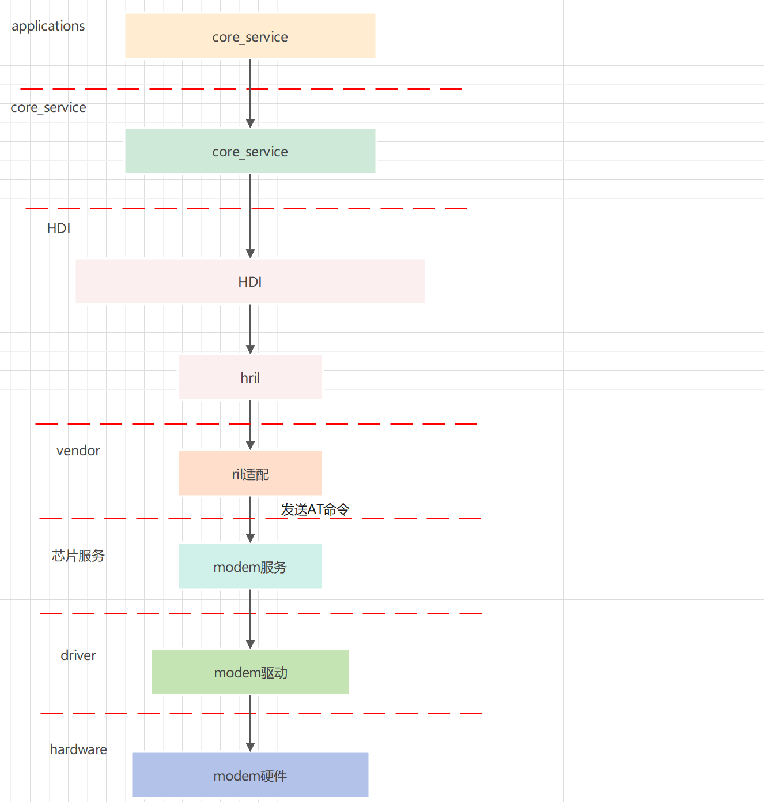
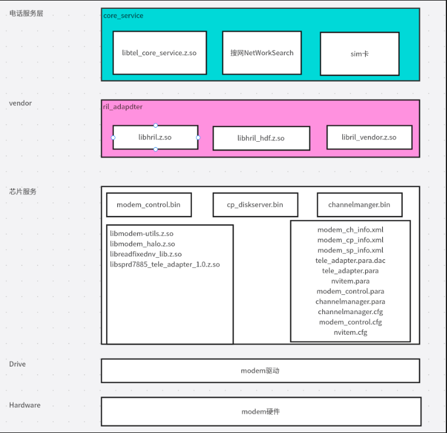
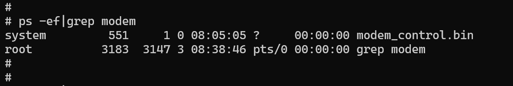
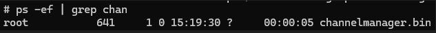
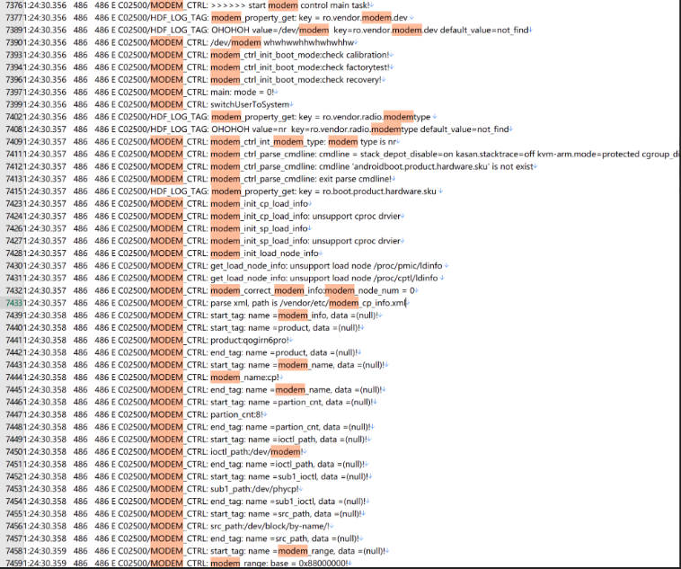

# 展锐7885芯片modem适配

## Telephony分层架构图

OpenHarmony的电话架构图如下图

- Framework：
  提供电话业务相关功能，包含通话管理，蜂窝通话，蜂窝数据，短彩信等。
- 服务层：
  电话服务核心层，包含SIM卡，搜网和底层接口调用。
- vendor：
  ril适配，提供电话服务与modem硬件通信的桥梁。实现包括芯片适配，厂商库加载，时间调度管理，业务抽象接口，接口实现等。OpenHarmony的电话架构图如下图2025年12月30号完成展锐 P7885-Wukong100 全栈适配（含 Kernel、HDF、ArkUI、系统服务）



## Modem适配介绍

modem适配需要完成的工作是，modem的HDI接口的适配。即下图中的“**ril适配**”部分。

在ril与modem硬件交互的方式中，不同的modem芯片会有不同的方法。

展锐7885的modem是通过展锐的提供的服务程序来与底层硬件交互。下图中的“**modem服务**”



展锐7885的modem服务结构图如下：



### 依赖

展锐modem依赖展锐底层服务，有如下程序

**服务程序**

modem\_control.bin

cp\_diskserver.bin

channelmanger.bin

### **so库文件**

libmodem-utils.z.so

libmodem_halo.z.so

libreadfixednv_lib.z.so

libsprd7885_tele_adapter_1.0.z.so

### **配置文件**

modem\_ch\_info.xml

modem\_cp\_info.xml

modem\_sp\_info.xml

tele_adapter.para.dac

tele_adapter.para

nvitem.para

modem_control.para

channelmanager.para

channelmanager.cfg

modem_control.cfg

nvitem.cfg

### 启动脚本

展锐modem功能依赖展锐底层服务modem\_control.bin和cp\_diskserver.bin，需要设置成开机自启动。

通过配置启动脚本modem.cfg，把modem\_control.bin和cp\_diskserver.bin设置成开机自启动

注：modem\_control.bin、cp\_diskserver.bin、channelmanger.bin启动依赖**so库文件**和**配置文件**

```
{
    "jobs": [
        {
            "name" : "init",
            "cmds" : [
                "setparam ro.vendor.radio.modemtype tl",
                "setparam ro.vendor.modem.tmctl /dev/sprd_time_sync",
                "mkdir /mnt/data",
                "chmod 0755 /mnt/data",
                "mkdir /mnt/vendor",
                "chmod 0755 /mnt/vendor"
            ]
        }, {
            "name": "post-fs-data",
            "cmds": [
                "start channelmanager_service"
            ]
        }
    ],
    "services": [
        {
            "name": "channelmanager_service",
            "start-mode": "condition",
            "path": [
                "/vendor/bin/channelmanager.bin"
            ],
            "uid": "root",
            "gid": [ "root", "system", "radio" ],
            "secon" : "u:r:chipset_init:s0"
        }
    ]
}

```

```
{
    "jobs": [
        {
            "name" : "init",
            "cmds": [
				"mkdir /mnt/data",
				"chmod 0755 /mnt/data"
            ]
        },
        {
            "name": "post-fs-data",
            "cmds": [
                "start cp_diskserver_service"
            ]
        }
    ],
    "services": [
		{
            "name": "cp_diskserver_service",
            "start-mode" : "condition",
            "path": [
                "/vendor/bin/cp_diskserver.bin"
            ],
            "uid": "root",
            "gid": [ "root", "system", "radio" ],
			"secon" : "u:r:chipset_init:s0"
        }
    ]
}
  
```

```
{
    "jobs": [
        {
            "name" : "init",
            "cmds": [
				"mkdir /mnt/data",
				"chmod 0755 /mnt/data"
            ]
        },
        {
            "name": "post-fs-data",
            "cmds": [
                "start modem_control_service"
            ]
        }
    ],
    "services": [
		{
            "name": "modem_control_service",
            "start-mode" : "condition",
            "path": [
                "/vendor/bin/modem_control.bin"
            ],
            "uid": "root",
            "gid": [ "root", "system", "radio" ],
			"secon" : "u:r:chipset_init:s0"
        }
    ]
}


```

### 启动

init进程启动时，首先完成系统初始化工作，然后开始解析配置文件。系统在解析配置文件时，会将配置文件分成三类：

1. init.cfg默认配置文件，由init系统定义，优先解析。
2. /system/etc/init/\*.cfg各子系统定义的配置文件。
3. /vendor/etc/init/\*.cfg厂商定义的配置文件。

当需要添加配置文件时，用户可以根据需要定义自己的配置文件，并拷贝到相应的目录下。

**启动配置文件是channelmanager.cfg、modem**\_control.cfg、nvitem.cfg

参考文档

[https://gitee.com/openharmony/docs/blob/master/zh-cn/device-dev/subsystems/subsys-boot-init-cfg.md](https://gitee.com/openharmony/docs/blob/master/zh-cn/device-dev/subsystems/subsys-boot-init-cfg.md)

### 验证

验证一，查看启动成功

验证modem\_control.bin是否启动成功



验证cp\_diskserver.bin是否启动成功


验证channelmanger.bin是否启动成功



查看modem提供的串口是否存在


### 日志

modem服务程序的打印日志可以从hilog中获取，开发者可以从日志中分析modem的状态。


