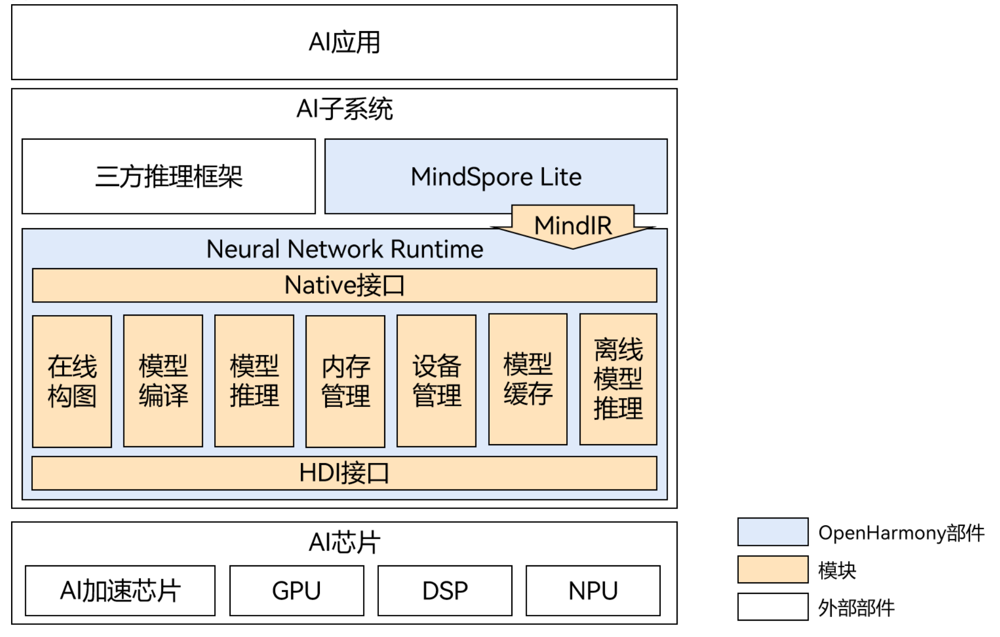
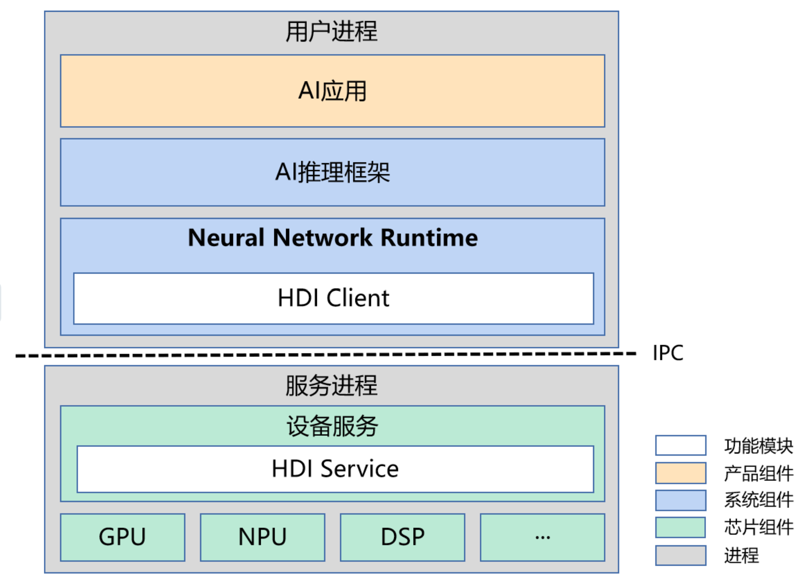

# Unisoc 7885 Chip NPU Adaptation to OpenHarmony

## OpenHarmony AI Overall Architecture

### AI Architecture Diagram



### AI Architecture Introduction

The entire architecture is mainly divided into three layers:

- AI applications are located at the application layer;
- AI inference framework MindSpore Lite and NNRt are located at the system layer;
- Device services are located at the chip layer.

For AI applications to complete model inference on dedicated acceleration chips, they need to go through the AI inference framework and NNRt to call the underlying chip devices. NNRt is responsible for adapting various underlying chip devices. It provides standard and unified southbound interfaces, and third-party chip devices can access OHOS through HDI interfaces.

## Edge-side Inference Engine -- MindSpore Lite

MindSpore Lite is the built-in edge-side AI inference engine in OpenHarmony, providing developers with unified AI inference interfaces to complete model inference processes on edge devices such as mobile phones. It has been widely used in applications such as image classification, object recognition, and text recognition.

There are two ways to develop AI applications based on MindSpore Lite:

- Method 1: [Develop AI applications using MindSpore Lite JS API](https://gitee.com/openharmony/docs/blob/OpenHarmony-4.0-Release/zh-cn/application-dev/ai/mindspore-guidelines-based-js.md), directly call MindSpore Lite JS API in UI code to load models and perform AI model inference. This method can quickly verify effects.

- Method 2: [Develop AI applications using MindSpore Lite Native API](https://gitee.com/openharmony/docs/blob/OpenHarmony-4.0-Release/zh-cn/application-dev/ai/mindspore-guidelines-based-native.md), encapsulate algorithm models and code calling MindSpore Lite Native API into dynamic libraries, and encapsulate them into JS interfaces through N-API for UI calls.

MindSpore Lite has been integrated with Neural Network Runtime through the Delegate mechanism. MindSpore Lite can schedule hardware acceleration chips that support NNRt to participate in the inference process.

## Neural Network Runtime

Neural Network Runtime (NNRt) serves as a bridge between upper-layer AI inference engines and lower-layer acceleration chips. It provides simplified Native interfaces for AI inference engines upwards, and provides unified AI chip driver interfaces downwards, meeting the needs of inference engines to perform end-to-end inference through acceleration chips, achieving cross-chip inference computation for AI models, and enabling AI chip drivers to access the OpenHarmony system.

### Neural Network Runtime HDI Interface


NNRt implements interfacing with device chips through HDI interface cross-process communication. During program runtime, AI applications, AI inference frameworks, and NNRt are all in the same process, while the underlying device service is in another process. Inter-process communication is through the IPC mechanism. NNRt implements HDI Client according to the southbound HDI interface, and the server side also needs to implement HDI Service according to the southbound HDI interface.

The location of NNRt HDI interface files is as follows:

```
/drivers/interface/nnrt/
├── bundle.json
├── v1_0
│   ├── BUILD.gn
│   ├── INnrtDevice.idl
│   ├── IPreparedModel.idl
│   ├── ModelTypes.idl
│   ├── NnrtTypes.idl
│   └── NodeAttrTypes.idl
└── v2_0
    ├── BUILD.gn
    ├── INnrtDevice.idl       # Define device-related interfaces
    ├── IPreparedModel.idl    # Define AI model-related interfaces
    ├── ModelTypes.idl        # AI model-related structure definitions
    ├── NnrtTypes.idl         # Nnrt data type definitions
    └── NodeAttrTypes.idl     # AI model operator attribute definitions
```

Interface introduction document directory path: [NNRt HDI Interface](https://gitee.com/openharmony/drivers_interface/tree/master/nnrt)

> Note: The v2.0 interface is used.

For AI chip devices that need to access OpenHarmony, they need to adapt the above HDI interfaces according to actual hardware capabilities and implement NNRt's HDI service.

## Unisoc NPU HDI Adaptation

### NNRt HDI Service Implementation

Create a directory named nnrt under the ```/device/soc/unisoc/p7885/hardware/npu/``` directory to implement the HDI service.

The directory structure is as follows:

```
device/soc/unisoc/p7885/hardware/npu/nnrt
├── BUILD.gn
├── include
│   ├── innrt_device_vdi.h              # NNRt interface header file for NPU chip
│   └── nnrt_common.h                   # Header file mainly defining NNRt hilog
├── nnrt_device_vdi_impl.cpp
├── prepared_model_impl_2_0.cpp
└── prepared_model_impl_2_0.h
```
```
device/soc/unisoc/p7885/hardware/npu/nnrt_drivers
└── v2_0
    ├── BUILD.gn
    ├── include
    │   └── nnrt_device_service.h       # Device service header file
    └── src
        ├── nnrt_device_driver.cpp      # Device driver implementation file
        └── nnrt_device_service.cpp     # Device service implementation file      
```

Here, the nnrt_host process is implemented according to the HDF framework, providing NPU hardware inference services to the upper layer.

The conversion from OpenHarmony NNRt HDI interface to Unisoc 7885 NPU chip functions is completed by calling the corresponding interfaces in libnnrt_vdi_impl.z.so through HDI interfaces.

In nnrt_device_service.cpp, the constructor of NnrtDeviceService loads libnnrt_vdi_impl.z.so through dlopen. All HDI interfaces provided by NnrtDeviceService are completed by calling vdi functions.

```
NnrtDeviceService::NnrtDeviceService()
NnrtDeviceService::NnrtDeviceService()
    : libHandle_(nullptr),
    createVdiFunc_(nullptr),
    destroyVdiFunc_(nullptr),
    vdiImpl_(nullptr)
{
    int32_t ret = LoadVdi();
    if (ret == HDF_SUCCESS) {
        vdiImpl_ = createVdiFunc_();
        if (NnrtCheckNullPointerOrReturnValue(vdiImpl_, __func__, __FILE__, __LINE__)) {
            return;
        }
    } else {
        HDF_LOGE("Load nnrt device VDI failed, lib: %{public}s", NNRT_DEVICE_VDI_LIBRARY);
    }
}
```

### Compile Driver and HDI Service Implementation Files into Shared Libraries

Create a BUILD.gn file under /device/soc/unisoc/p7885/hardware/npu/nnrt_drivers/v2_0/, with the following content:

```
import("//build/ohos.gni")
import("//device/soc/unisoc/p7885/soc_common.gni")
import("//drivers/hdf_core/adapter/uhdf2/uhdf.gni")

ohos_shared_library("libnnrt_device_service_2.0") {
  sources = [ "src/nnrt_device_service.cpp" ]

  include_dirs = [
    "include",
    "../../nnrt/include",
  ]

  external_deps = [
    "c_utils:utils",
    "drivers_interface_nnrt:libnnrt_stub_2.0",
    "hdf_core:libhdf_utils",
    "hdf_core:libhdi",
    "hilog:libhilog",
    "ipc:ipc_core",
  ]

  install_images = [ chipset_base_dir ]
  subsystem_name = "soc_p7885"
  part_name = "soc_p7885"
}

ohos_shared_library("libnnrt_driver") {
  include_dirs = [ "include" ]
  sources = [ "src/nnrt_device_driver.cpp" ]
  deps = []

  external_deps = [
    "c_utils:utils",
    "drivers_interface_nnrt:libnnrt_stub_2.0",
    "drivers_interface_nnrt:nnrt_idl_headers",
    "hdf_core:libhdf_host",
    "hdf_core:libhdf_ipc_adapter",
    "hdf_core:libhdf_utils",
    "hdf_core:libhdi",
    "hilog:libhilog",
    "hitrace:hitrace_meter",
    "init:libbegetutil",
    "ipc:ipc_single",
  ]

  shlib_type = "hdi"
  install_images = [ chipset_base_dir ]
  subsystem_name = "soc_p7885"
  part_name = "soc_p7885"
}

group("hdf_nnrt_service") {
  deps = [
    ":libnnrt_device_service_2.0",
    ":libnnrt_driver",
  ]
}
```

Add group("hdf_nnrt_service") to the /device/soc/spreadtrum/common/nnrt/BUILD.gn file so that upper-level directories can reference it.

```
group("nnrt_entry") {
  deps = [ 
    "./v2_0:hdf_nnrt_service",
  ]
}
```

### Declare HDI Service

Declare NNRt's user-mode driver and service in the corresponding product's uhdf hcs configuration file.

The service needs to add the following configuration in the ```/vendor/revoview/wukong100/hdf_config/uhdf/device_info.hcs``` file:

```
nnrt::host {
            hostName = "nnrt_host";
            priority = 50;
            uid = "";
            gid = "";
            caps = ["DAC_OVERRIDE", "DAC_READ_SEARCH"];
            nnrt_device :: device {
                device0 :: deviceNode {
                    policy = 2;
                    priority = 100;
                    preload = 0;
                    moduleName = "libnnrt_driver.z.so";
                    serviceName = "nnrt_device_service";
                }
            }
        }
```

\> Note: After modifying the hcs file, you need to delete the out directory and recompile for it to take effect.

### Configure User ID and Group ID for nnrt host Process

For the scenario of adding a new nnrt_host process, you need to configure the corresponding process's user ID and group ID. The process user ID is configured in the file ```/vendor/revoview/wukong100/etc/passwd```, and the process group ID is configured in the file ```/vendor/revoview/wukong100/etc/group```. During compilation, they will be copied to the corresponding path configured in ```/vendor/revoview/wukong100/etc/BUILD.gn```.

```text
# Add in /vendor/revoview/wukong100/etc/passwd
nnrt_host:x:3311:3311:::/bin/false

# Add in /vendor/revoview/wukong100/etc/group
nnrt_host:x:3311:
```

### Debugging and Verification
After adaptation is completed, developers can verify through the following steps:

1. Verify whether the nnrt_host service process exists

    Use the command ```hdc shell "ps -A | grep nnrt_host"``` to check if the process exists.

2. Verify whether the so files exist

    Use the command ```hdc shell "ls /vendor/lib64 | grep nnrt"``` to check if the following so files exist.

    ```shell
    libnnrt_device_service_2.0.z.so
    libnnrt_driver.z.so
    libnnrt_stub_1.0.z.so
    libnnrt_stub_2.0.z.so
    ```

## Related Repositories

[**device\_board\_revoview**](https://gitcode.com/openharmony-sig/device_board_revoview)

[**vendor\_revoview**](https://gitcode.com/openharmony-sig/vendor_revoview)
