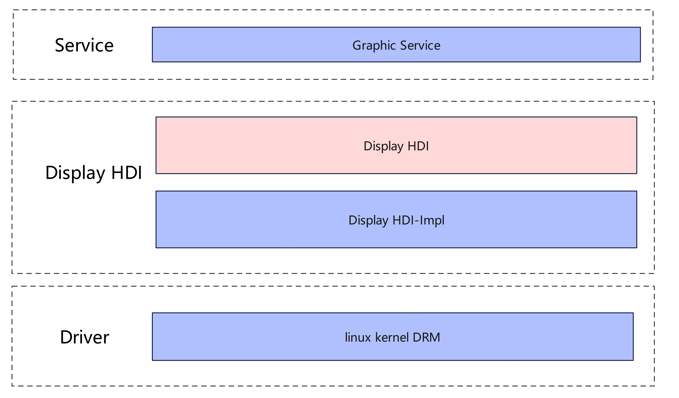
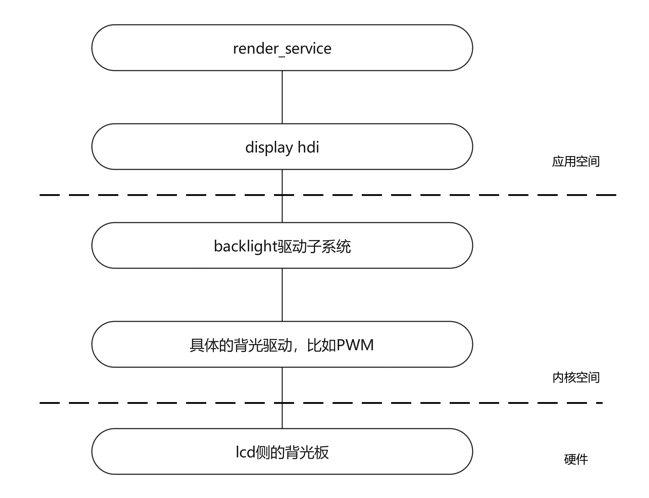
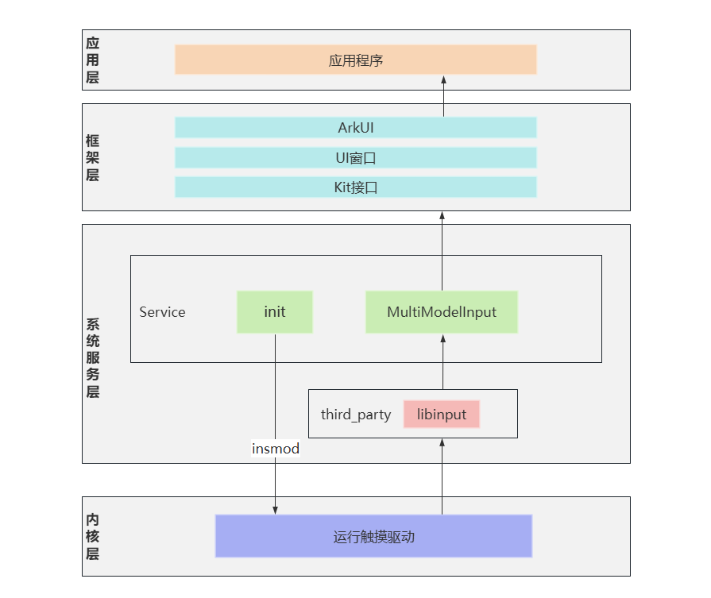

# 展锐7885芯片screen适配

## LCD适配
7885平台默认支持一个mipi接口的lcd屏幕

如图为Display 驱动模型层次关系图


当前如图模型主要部署在内核态中，向上提供libdrm 接口，辅助HDI的实现。显示驱动通过Display-HDI 层对图形服务暴露显示屏驱动能力；向下对接显示屏panel器件，驱动屏幕正常工作，自上而下打通显示全流程通路。

所以LCD的适配主要在于LCD panel器件驱动的适配

器件驱动的适配分为2部分：panel驱动和dts配置

libpanel.z.so在产品上的存放位置为:
/system/lib64/module/inputmethod/libpanel.z.so

### panel 驱动
器件驱动主要围绕如下接口展开：
~~~
struct drm_panel_funcs {
    int (*prepare)(struct drm_panel *panel);
    int (*unprepare)(struct drm_panel *panel);
    int (*enable)(struct drm_panel *panel);
    int (*disable)(struct drm_panel *panel);
    int (*get_modes)(struct drm_panel *panel, struct drm_connector *connector);
    int (*get_timings)(struct drm_panel *panel, unsigned int num_timings,
                       struct display_timing *timings);
    int (*get_edid)(struct drm_panel *panel, struct edid *edid);
};
~~~

驱动中在初始化接口中实例化该结构体：

~~~
static const struct drm_panel_funcs sprd_panel_funcs = {
	.get_modes = sprd_panel_get_modes,
	.enable = sprd_panel_enable,
	.disable = sprd_panel_disable,
	.prepare = sprd_panel_prepare,
	.unprepare = sprd_panel_unprepare,
};
~~~

get_modes 提供面板支持的显示模式（分辨率、刷新率）。  
enable  激活面板显示（打开按键、信号控制）。  
disable  取消面板显示（关闭账单、停止信号）。  
prepare 准备面板硬件进入工作状态（供电和初始化）。 
unprepare 将面板硬件从工作状态置于非工作状态（断电和清理）。  

dts配置
~~~
/ {
	fragment {
		target-path = "/";
		__overlay__ {
			lcds {
				lcd_hx8279_revo_mipi: lcd_hx8279_revo_mipi {

					sprd,dsi-work-mode = <1>;
					sprd,dsi-lane-number = <4>;
					sprd,dsi-color-format = "rgb888";

					sprd,phy-bit-clock = <1105000>;

					sprd,width-mm = <107>;
					sprd,height-mm = <172>;

					sprd,esd-check-enable = <0>;
					sprd,esd-check-mode = <1>;
					sprd,esd-check-period = <2000>;

					sprd,reset-on-sequence = <1 10>, <0 20>, <1 100>;
					sprd,reset-off-sequence = <0 20>;

					sprd,initial-command = [
						.........
						13 14 00 01 29
					];
					
					sprd,sleep-in-command = [
						13 0A 00 01 28
						13 78 00 01 10
					];

					sprd,sleep-out-command = [
						13 78 00 01 11
						13 64 00 01 29
					];

					display-timings {
						native-mode = <&hx8279_revo_timing0>;
						hx8279_revo_timing0: timing0 {
						        clock-frequency = <153600000>;
						        hactive = <1200>;
						        vactive = <1920>;
						        hfront-porch = <80>;  //80
						        hback-porch = <70>;   //40
						        hsync-len = <10>;     //10
						        vfront-porch = <35>;  //26
						        vback-porch = <32>;   //31
						        vsync-len = <4>;      //2
							};
						};
					};
			};
		};
	};
};


~~~

## 背光
基于Linux驱动框架开发的 背光驱动模型

7885背光是通过pwm控制占空比实现的。

### backlight 驱动

libbrightness.z.so在产品上存放的位置为：
/system/lib64/module/libbrightness.z.so

器件驱动主要围绕如下接口展开：
~~~
struct backlight_ops {
    int (*update_status)(struct backlight_device *bd);
    int (*get_brightness)(struct backlight_device *bd);
};
~~~

驱动中在初始化接口中实例化该结构体：
~~~
static const struct backlight_ops sprd_backlight_ops = {
	.update_status = sprd_pwm_backlight_update,
};
~~~

update_status 用于将用户设置的亮度值更新为硬件

在display hdi 中通过设置背光驱动节点，达到调节背光的目的
~~~
int32_t DrmConnector::SetBrightness(uint32_t level)
{
    static int32_t brFd = 0;
    const int32_t buffer_size = 10; /* buffer size */
    char buffer[buffer_size];

    DISPLAY_LOGE("set %{public}d", level);
    if (brFd <= 0) {
        brFd = open("/sys/class/backlight/sprd_backlight/brightness", O_RDWR);
        if (brFd < 0) {
            DISPLAY_LOGE("open brightness file failed\n");
            return DISPLAY_NOT_SUPPORT;
        }
    }
    errno_t ret = memset_s((void *)buffer, sizeof(buffer), 0, sizeof(buffer));
    if (ret != EOK) {
        DISPLAY_LOGE("memset_s failed\n");
        return DISPLAY_FAILURE;
    }

    int bytes = sprintf_s(buffer, sizeof(buffer), "%d\n", level);
    if (bytes < 0) {
        DISPLAY_LOGE("change failed\n");
        return DISPLAY_FAILURE;
    }
    write(brFd, buffer, bytes);
    mBrightnessLevel = level;
    return DISPLAY_SUCCESS;
}
~~~

## TP适配



WUKONG100的TP驱动采用Linux原生驱动，当OH启动时，init进程会通过insmod加载触摸驱动.ko文件并创建input设备节点/dev/input/event2；

当触摸屏产生输入事件时，通过第三方库libinput来检测和接收输入事件，同时libinput对接到多模输入子系统服务端的LibinputAdapter，多模服务端会对输入事件进行归一化和标准化后通过innerSDK分发到ArkUI框架，ArkUI框架封装事件后转发到应用，或者innerSDK通过JsKit接口直接分发事件到应用。

具体多模子系统的更多内容可以参考：https://gitee.com/openharmony/multimodalinput_input

TP驱动的适配包括设备树节点配置，驱动程序编译和加载配置：

### 设备树配置

在对应dts文件中增加触摸节点配置：

```patch
&i2c3 {
        #address-cells = <1>;
        #size-cells = <0>;

        status = "okay";
        touchscreen@40 {
                compatible = "gslx680,gslx680_ts";
                reg = <0x40>;
                reset-gpio = <&ap_gpio 14 0>;
                irq-gpio = <&ap_gpio 13 0>;
        };
};	
```

### TP ko编译及加载

以ko的方式加载tp驱动，可以优化内核的启动速度，同时也更灵活。

TP的驱动，由厂家提供。

>TP驱动适配有两种方式：
>1、直接使用linux原生驱动，此方式可以参考本文档。
>2、使用hdf框架适配驱动，参考: [TP驱动模型](https://gitee.com/openharmony/docs/blob/master/zh-cn/device-dev/porting/porting-dayu200-on_standard-demo.md#tp)

#### ko安装到img

~~~gn
ohos_prebuilt_executable("gslx680") {
  deps = [ ":build_modules" ]
  source = "$root_build_dir/modules/gslx680/gslx680.ko"
  module_install_dir = "modules"
  install_images = [ chipset_base_dir ]
  part_name = "product_wukong100"
  install_enable = true
}

group("modules") {
  deps = [
    ......
    ":regulatory.db.p7s",
    ":mali_kbase",
    ":gslx680",
~~~

#### ko开机安装

~~~
"insmod /vendor/modules/gslx680.ko"
~~~

安装成功后，如果驱动没有问题，会创建新的input节点:

~~~
/dev/input/eventX
~~~

### TP驱动测试

使用getevent工具测试

~~~
# ./getevent -l
add device 1: /dev/input/event5
  name:     "VSoC touchscreen"
add device 2: /dev/input/event4
  name:     "sprdphone-sc2730 Headset Keyboard"
add device 3: /dev/input/event3
  name:     "sprdphone-sc2730 Headset Jack"
add device 4: /dev/input/event2
  name:     "gsl680_tp"
add device 5: /dev/input/event1
  name:     "gpio-keys"
add device 6: /dev/input/event0
  name:     "sc27xx:vibrator"
/dev/input/event2: EV_SYN       SYN_MT_REPORT        00000000
/dev/input/event2: EV_SYN       SYN_REPORT           00000000
/dev/input/event2: EV_ABS       ABS_MT_TOUCH_MAJOR   0000000a
/dev/input/event2: EV_ABS       ABS_MT_POSITION_X    00000164
/dev/input/event2: EV_ABS       ABS_MT_POSITION_Y    00000506
/dev/input/event2: EV_ABS       ABS_MT_TRACKING_ID   00000001
/dev/input/event2: EV_KEY       BTN_TOUCH            DOWN
/dev/input/event2: EV_SYN       SYN_MT_REPORT        00000000
/dev/input/event2: EV_SYN       SYN_REPORT           00000000
~~~

这代表触摸驱动已经正常。