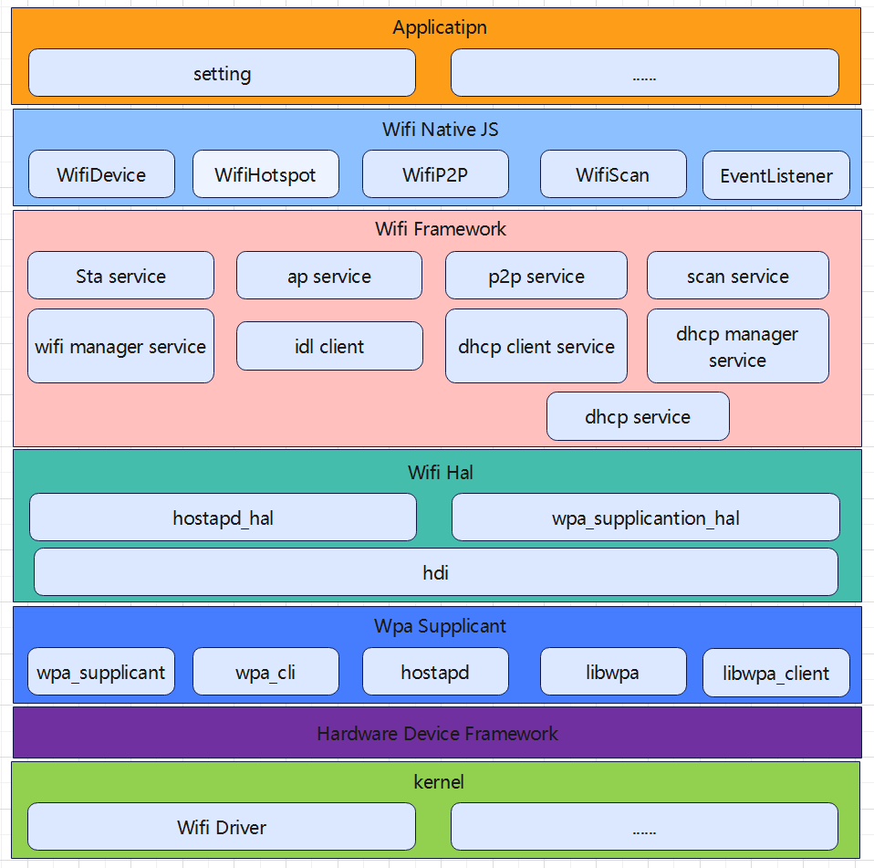
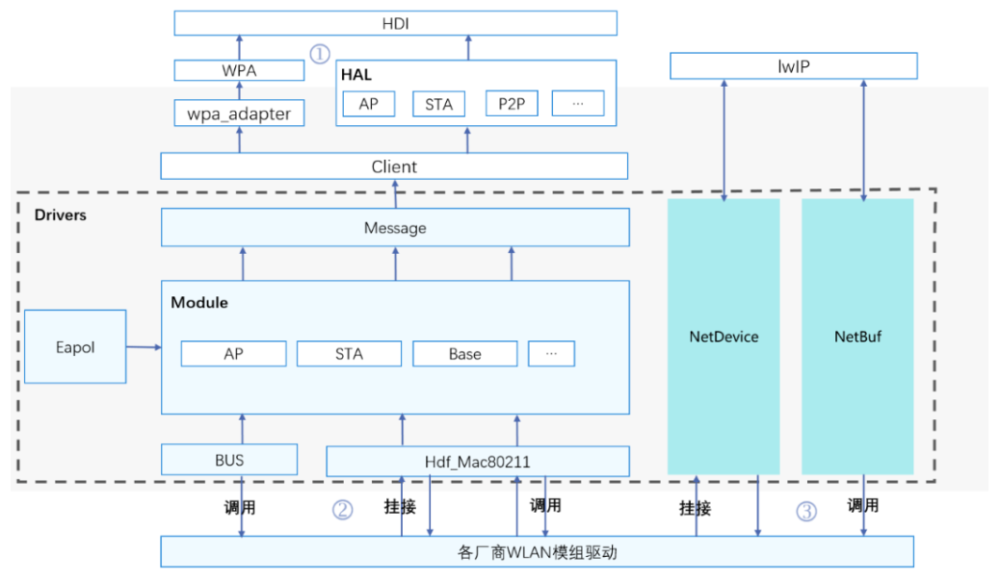
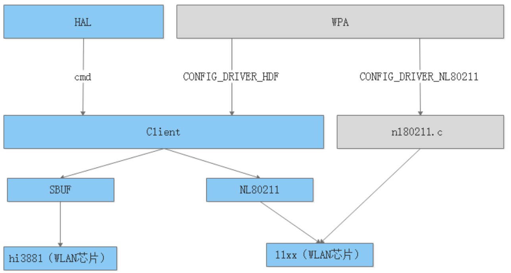
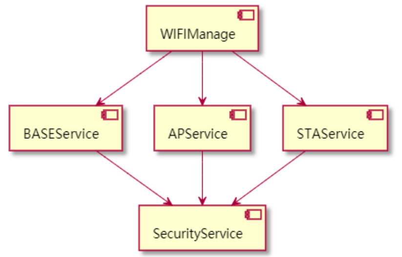
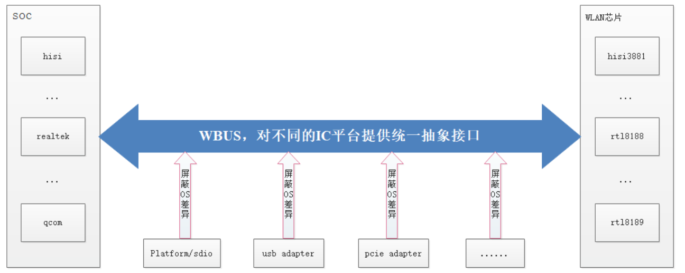
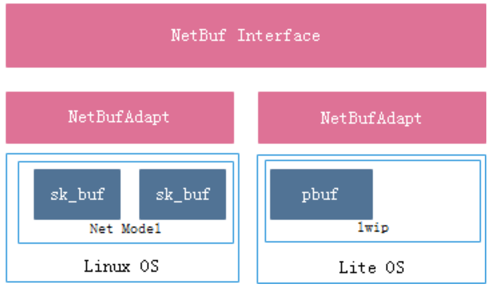
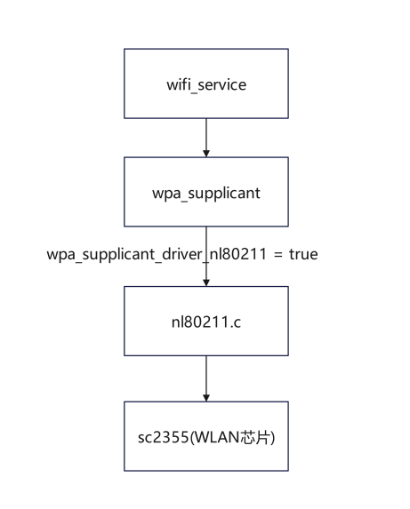

# OpenHarmony WiFi架构

- Applicantion：主要是开发者自行开发WiFi相关功能的应用。通过调用Wifi SDK对外提供的API实现对设备WiFi的控制及其功能实现。这一层平台将会提供相关的API调用示例，以供参考。

- WiFi Native JS: JS层使用NAPI机制开发，连接APP层与Framework层，将wifi功能封装成JS接口提供给应用调用，并同时支持Promise和Callback异步回调。

- WiFi Framework：WiFi核心功能实现。直接为上层应用提供服务。根据其工作模式的不同分为四大业务服务模块，分别是STA服务、AP服务、P2P服务、Aware服务，同时DHCP功能。

- WiFi Hal：为FrameWork层操作WiFi硬件提供统一的接口服务，实现应用框架与硬件操作的分离。主要包括Hal适配器及扩展Hal模块及WiFi硬件厂家提供的二进制库模块。

- Wpa Supplicant：包含wpa_supplicant和hosapd两个子模块，wpa_supplicant和hostapd实现了定义好的驱动API，对外提供控制接口，框架就能通过其控制接口来实现Wifi的各种操作。wpa_supplicant支持STA及P2P模式，hostapd则支持AP模式。

- HDF：HDF 驱动框架主要由驱动基础框架、驱动程序、驱动配置文件和驱动接口这四个部分组成，实现WIfi驱动功能，加载驱动，驱动接口部署等。

- WiFi Kernel：包含WiFi 驱动，包括了对设备的一些基本的读写操作由WiFi驱动移植人员编译进内核。

# WiFi驱动框架

WLAN驱动框架组成：

驱动架构主要由 HAL、Client、Module、NetDevice、NetBuf、BUS和 Message 这七个部分组成。

- HAL

HAL 部件对 WiFiService 模块提供标准的 WIFI-HDI 接口和数据格式定义，提供能力如下：设置 MAC 地址、设置发射功率、获取设备的 MAC 地址等。

- Client

Client 部件实现用户态与内核态的交互，通过对 sbuf 及 nl80211 做不同适配，根据产品做配置化编译，从而实现对上提供统一的接口调用，框架如下图所示：

- Message

Message 部件为每个服务单独提供业务接口，此模块支持在用户态、内核态和 MCU 环境运行，实现了组件间的充分解耦。

- Module

 Module 基于 HDF 驱动框架实现 WiFi 框架的启动加载、配置文件的解析、设备驱动的初始化和芯片驱动的初始化等功能，根据 WLAN 的功能特性，划分 Base、AP、STA 等部件，对控制流的命令和事件进行统一管理。

- BUS

BUS 驱动模块向上提供统一的总线抽象接口。通过向下调用 Platform 层提供的 sdio 接口和封装适配 usb、pcie 接口，屏蔽不同操作系统的差异；通过对不同类型的总线操作进行统一封装，屏蔽不同芯片差异，能够对不同芯片厂商提供完备的总线驱动功能，不同厂商共用此模块接口，从而使厂商的开发更为便捷和统一，框架如下图所示：

- NetDevice

NetDevice 用于建立专属网络设备，屏蔽不同 OS 的差异，对 WIFI 驱动提供统一接口，提供统一的 HDF NetDevice 数据结构，及其统一管理、注册、去注册能力；对接富设备上的 Linux 的网络设备层；对接轻设备上的 Linux 的网络设备层。

- NetBuf

NetBuf 部件为 WLAN 驱动提供 Linux 或者 LiteOS 原生的网络数据缓冲的统一数据结构的封装以及对网络数据的操作接口的封装，框架如下图所示：

# WiFi驱动适配

目前适配wlan的方法都是基于WPA三方框架直接CONFIG_DRIVER_NL80211走的nl80211协议，直接连接到芯片驱动上，也就是Client流程中走的nl80211协议流程，流程如下。

## 适配准备

- 原厂代码和固件

## 在vendor层进行适配

在device_soc_sprd\common\wcn目录下创建wlan目录，把厂家的bin文件和C代码移植进去，然后按照单板具体情况修改build_modules.sh和build.gn代码

1. 在build_modules.sh增加socket类型和芯片型号

~~~
#wcn bt driver config
export BSP_BOARD_UNISOC_WCN_SOCKET="sdio"

#wcn module version config
export BSP_BOARD_WLAN_DEVICE="sc2355"
~~~

2. 在build.gn中

~~~
outputs += [ "$root_build_dir/modules/sprd_wlan_combo/sprd_wlan_combo.ko" ]
#  outputs += [ "$root_build_dir/kernel/OBJ/linux-5.15/drivers/unisoc_platform/wlan/sc2355/sc2355_sdio_wlan.ko" ]
~~~

~~~
ohos_prebuilt_executable("wifi_board_config") {
  source = "wcn/wifi_board_config.ini"
  module_install_dir = "lib/firmware"
  install_images = [ "system" ]
  part_name = "product_oriole"
  install_enable = true
}
~~~

~~~
ohos_prebuilt_executable("sprd_wlan_combo") {
  deps = [ ":build_modules" ]
  source = "$root_build_dir/modules/sprd_wlan_combo/sprd_wlan_combo.ko"
  module_install_dir = "modules"
  install_images = [ chipset_base_dir ]
  part_name = "product_oriole"
  install_enable = true
}
~~~

3. 在vendor\hys\oriole\config.json中增加

~~~
 {
      "subsystem": "thirdparty",
      "components": [
        {
          "component": "wpa_supplicant",
          "features": [
            "wpa_supplicant_driver_nl80211 = true",
            "wpa_supplicant_driver_nl80211_sprd = true"
          ]
        }
      ]
    },
  ... ...
~~~

 
